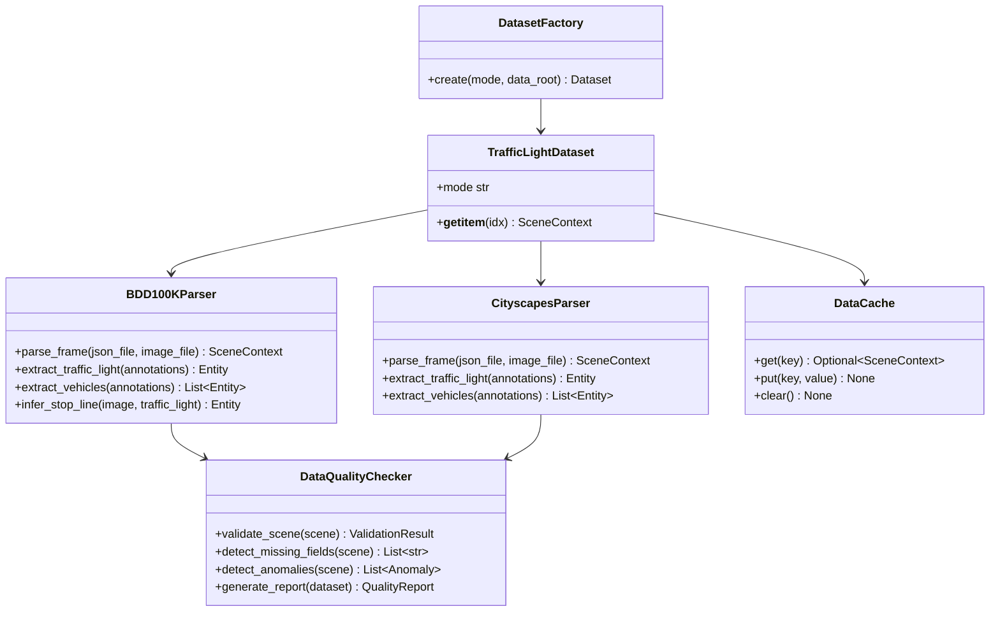
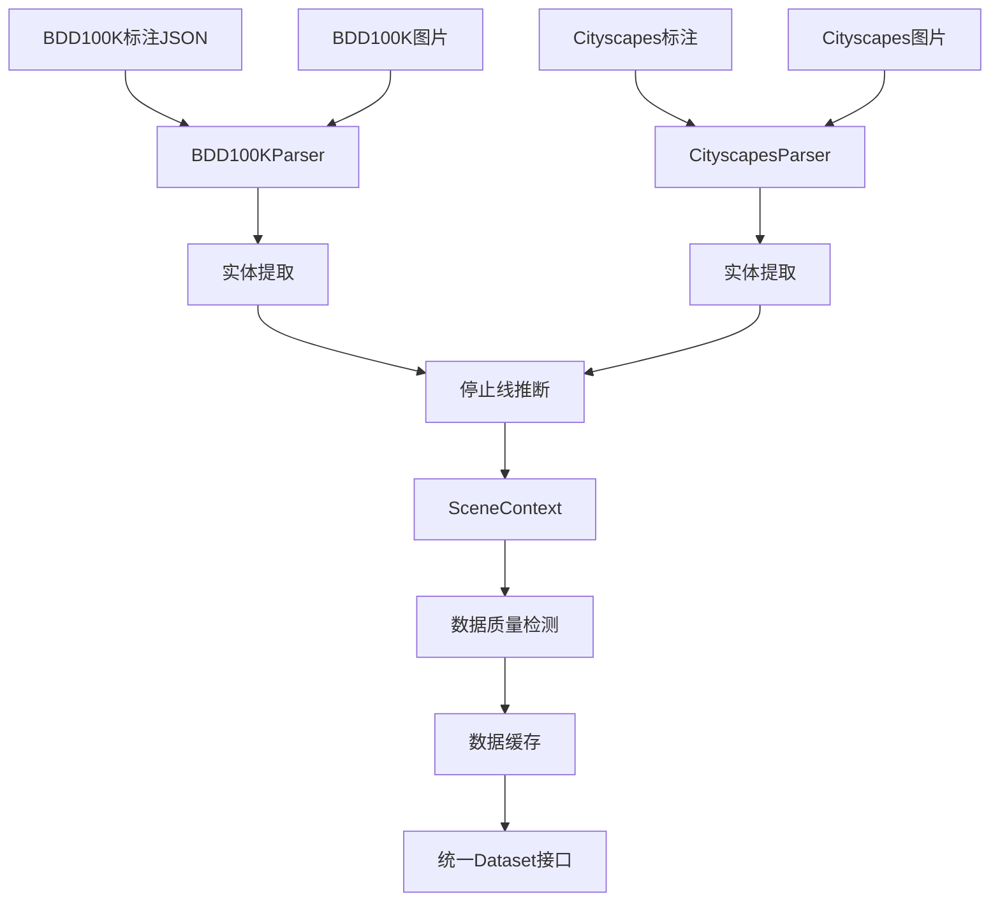

# 详细设计：BIZ-002 真实数据集整合

## A. 需求概述

### 需求编号
- 业务需求：BIZ-002
- 系统需求：SYS-F-003
- 当前完成度：0%（完全未实现）

### 业务价值
- 接入真实场景数据（BDD100K、Cityscapes），提升模型泛化能力
- 统一synthetic与真实数据的接口，便于切换和混合训练
- 提供数据质量检测，确保标注准确性
- 建立数据缓存机制，加速训练迭代

### 验收标准
- ✅ 数据加载成功率>99%（BDD100K + Cityscapes各100个样本）
- ✅ 标注解析正确（交通灯、车辆、停止线实体）
- ✅ 与synthetic数据接口一致（返回SceneContext）
- ✅ 数据质量报告生成（缺失字段统计、异常值检测）
- ✅ 评估结果可复现（固定随机种子）

## B. 架构设计

### 组件图



### 数据流图



## C. 接口设计

### C.1 BDD100K解析器

```python
class BDD100KParser:
    """
    BDD100K数据集解析器
    
    数据格式：
        - 标注：JSON格式（COCO风格）
        - 图片：JPG格式
        - 标签：category_id映射到交通元素
    
    参考：https://doc.bdd100k.com/format.html
    """
    
    def __init__(
        self,
        data_root: Path,
        label_mapping: Optional[Dict[str, int]] = None,
    ):
        """
        初始化解析器
        
        Args:
            data_root: BDD100K根目录
            label_mapping: 标签映射（category_name -> category_id）
        """
        self.data_root = Path(data_root)
        self.label_mapping = label_mapping or {
            'traffic light': 10,
            'car': 3,
            'truck': 8,
            'bus': 6,
        }
    
    def parse_frame(
        self,
        image_id: str,
        split: str = 'val',
    ) -> SceneContext:
        """
        解析单帧数据
        
        Args:
            image_id: 图片ID（如 '0000f77c-6257be58'）
            split: 数据分割 ('train' | 'val' | 'test')
        
        Returns:
            scene: SceneContext对象
        """
        # 加载标注JSON
        anno_path = self.data_root / 'labels' / split / f'{image_id}.json'
        with open(anno_path) as f:
            anno_data = json.load(f)
        
        # 加载图片
        img_path = self.data_root / 'images' / split / f'{image_id}.jpg'
        image = cv2.imread(str(img_path))
        
        # 提取实体
        entities = []
        
        # 1. 提取交通灯
        traffic_lights = self.extract_traffic_lights(anno_data)
        entities.extend(traffic_lights)
        
        # 2. 提取车辆
        vehicles = self.extract_vehicles(anno_data)
        entities.extend(vehicles)
        
        # 3. 推断停止线（BDD100K无停止线标注，需推断）
        if traffic_lights:
            stop_line = self.infer_stop_line(image, traffic_lights[0])
            if stop_line:
                entities.append(stop_line)
        
        # 4. 计算停止线距离
        if stop_line:
            for vehicle in [e for e in entities if e.type == 'car']:
                vehicle.d_stop = compute_stop_line_distance(
                    vehicle.pos,
                    stop_line.pos,
                    stop_line.end_pos,
                )
        
        # 构建SceneContext
        scene = SceneContext(
            scene_id=image_id,
            timestamp=anno_data.get('timestamp', 0.0),
            entities=entities,
            image=image,
        )
        
        return scene
    
    def extract_traffic_lights(
        self,
        anno_data: Dict,
    ) -> List[Entity]:
        """
        从BDD100K标注提取交通灯
        
        Args:
            anno_data: 标注数据字典
        
        Returns:
            traffic_lights: 交通灯实体列表
        """
        lights = []
        
        for obj in anno_data.get('frames', [{}])[0].get('labels', []):
            if obj['category'] == 'traffic light':
                # 提取bbox
                box2d = obj['box2d']
                x1, y1 = box2d['x1'], box2d['y1']
                x2, y2 = box2d['x2'], box2d['y2']
                
                # 提取交通灯颜色（如果有attributes）
                light_state = 'red'  # 默认
                if 'attributes' in obj and 'trafficLightColor' in obj['attributes']:
                    color_map = {'red': 'red', 'green': 'green', 'yellow': 'yellow'}
                    light_state = color_map.get(obj['attributes']['trafficLightColor'], 'red')
                
                entity = Entity(
                    id=f"light_{obj['id']}",
                    type='light',
                    pos=[(x1 + x2) / 2, (y1 + y2) / 2],
                    bbox=[x1, y1, x2, y2],
                    light_state=light_state,
                    confidence=0.9,  # BDD100K为人工标注，置信度高
                )
                lights.append(entity)
        
        return lights
    
    def extract_vehicles(
        self,
        anno_data: Dict,
    ) -> List[Entity]:
        """
        从BDD100K标注提取车辆
        
        Returns:
            vehicles: 车辆实体列表
        """
        vehicles = []
        
        vehicle_categories = ['car', 'truck', 'bus']
        
        for obj in anno_data.get('frames', [{}])[0].get('labels', []):
            if obj['category'] in vehicle_categories:
                box2d = obj['box2d']
                x1, y1 = box2d['x1'], box2d['y1']
                x2, y2 = box2d['x2'], box2d['y2']
                
                # 速度推断（BDD100K无速度标注，使用默认或光流估计）
                velocity = self.estimate_velocity(obj)
                
                entity = Entity(
                    id=f"car_{obj['id']}",
                    type='car',
                    pos=[(x1 + x2) / 2, (y1 + y2) / 2],
                    bbox=[x1, y1, x2, y2],
                    velocity=velocity,
                    d_stop=999.0,  # 待计算
                )
                vehicles.append(entity)
        
        return vehicles
    
    def infer_stop_line(
        self,
        image: np.ndarray,
        traffic_light: Entity,
    ) -> Optional[Entity]:
        """
        推断停止线位置（BDD100K无停止线标注）
        
        推断策略：
            1. 假设停止线在交通灯下方
            2. 距离=交通灯bbox底部向下30-50像素
            3. 水平线（与图片底边平行）
        
        Args:
            image: 原始图片
            traffic_light: 交通灯实体
        
        Returns:
            stop_line: 停止线实体（或None如果无法推断）
        """
        if traffic_light.bbox is None:
            return None
        
        _, _, _, light_y2 = traffic_light.bbox
        h, w, _ = image.shape
        
        # 推断停止线y坐标（交通灯下方30-50像素）
        stop_y = min(light_y2 + 40, h - 10)
        
        # 停止线为水平线（横跨图像宽度的80%）
        x1 = w * 0.1
        x2 = w * 0.9
        
        stop_line = Entity(
            id='stop_0',
            type='stop',
            pos=[(x1 + x2) / 2, stop_y],
            end_pos=[x2, stop_y],
            bbox=[x1, stop_y - 2, x2, stop_y + 2],
        )
        
        return stop_line
    
    def estimate_velocity(
        self,
        vehicle_obj: Dict,
    ) -> float:
        """
        估计车辆速度（BDD100K无速度标注）
        
        策略：
            1. 如果有tracking信息，使用光流估计
            2. 否则，使用默认值（如5.0 m/s）
        
        Args:
            vehicle_obj: 车辆标注对象
        
        Returns:
            velocity: 速度估计值（m/s）
        """
        # TODO: 实现基于tracking的速度估计
        # 当前返回默认值
        return 5.0  # 默认速度
```

### C.2 Cityscapes解析器

```python
class CityscapesParser:
    """
    Cityscapes数据集解析器
    
    数据格式：
        - 标注：JSON格式（polygon格式）
        - 图片：PNG格式
        - 语义分割：有traffic light/vehicle类别
    
    参考：https://www.cityscapes-dataset.com/dataset-overview/
    """
    
    def __init__(self, data_root: Path):
        """
        初始化解析器
        
        Args:
            data_root: Cityscapes根目录
        """
        self.data_root = Path(data_root)
        self.label_ids = {
            'traffic light': 19,
            'car': 26,
            'truck': 27,
            'bus': 28,
        }
    
    def parse_frame(
        self,
        city: str,
        frame_id: str,
        split: str = 'val',
    ) -> SceneContext:
        """
        解析单帧数据
        
        Args:
            city: 城市名（如'zurich'）
            frame_id: 帧ID（如'zurich_000000_000019'）
            split: 数据分割
        
        Returns:
            scene: SceneContext对象
        """
        # Cityscapes路径结构：
        # - images: leftImg8bit/val/zurich/zurich_000000_000019_leftImg8bit.png
        # - labels: gtFine/val/zurich/zurich_000000_000019_gtFine_polygons.json
        
        img_path = (
            self.data_root / 'leftImg8bit' / split / city /
            f'{frame_id}_leftImg8bit.png'
        )
        anno_path = (
            self.data_root / 'gtFine' / split / city /
            f'{frame_id}_gtFine_polygons.json'
        )
        
        # 加载数据
        image = cv2.imread(str(img_path))
        with open(anno_path) as f:
            anno_data = json.load(f)
        
        # 提取实体（类似BDD100K逻辑）
        entities = []
        entities.extend(self.extract_traffic_lights(anno_data))
        entities.extend(self.extract_vehicles(anno_data))
        # ...推断停止线
        
        scene = SceneContext(
            scene_id=frame_id,
            timestamp=0.0,
            entities=entities,
            image=image,
        )
        
        return scene
    
    # ...其他方法类似BDD100KParser
```

### C.3 数据质量检测器

```python
@dataclass
class ValidationResult:
    """数据验证结果"""
    is_valid: bool
    missing_fields: List[str]
    anomalies: List[str]
    warnings: List[str]

@dataclass
class Anomaly:
    """数据异常"""
    type: str  # 'missing_entity' | 'invalid_value' | 'bbox_error'
    field: str
    value: Any
    expected: str
    scene_id: str

class DataQualityChecker:
    """
    数据质量检测器
    
    检测项：
        1. 必需字段完整性（场景必须有至少1辆车）
        2. 数值合理性（速度非负、bbox坐标有效等）
        3. 逻辑一致性（bbox在图像范围内）
    """
    
    def __init__(self):
        """初始化检测器"""
        self.required_entity_types = ['car']  # 至少要有车辆
        self.optional_entity_types = ['light', 'stop']
    
    def validate_scene(
        self,
        scene: SceneContext,
    ) -> ValidationResult:
        """
        验证单个场景
        
        Args:
            scene: 场景数据
        
        Returns:
            result: 验证结果
        """
        missing_fields = []
        anomalies = []
        warnings = []
        
        # 检查1：必需实体
        has_car = any(e.type == 'car' for e in scene.entities)
        if not has_car:
            missing_fields.append('car entity')
        
        # 检查2：数值合理性
        for entity in scene.entities:
            # 位置检查
            if entity.pos is None:
                anomalies.append(f"{entity.id}: 缺少pos字段")
            
            # bbox检查
            if entity.bbox:
                x1, y1, x2, y2 = entity.bbox
                if x2 <= x1 or y2 <= y1:
                    anomalies.append(f"{entity.id}: bbox无效 ({x1},{y1},{x2},{y2})")
                
                # bbox在图像范围内
                if scene.image is not None:
                    h, w = scene.image.shape[:2]
                    if x1 < 0 or y1 < 0 or x2 > w or y2 > h:
                        warnings.append(f"{entity.id}: bbox超出图像范围")
            
            # 车辆速度检查
            if entity.type == 'car':
                if entity.velocity is None:
                    warnings.append(f"{entity.id}: 缺少velocity（已设置默认值）")
                    entity.velocity = 0.0
                elif entity.velocity < 0:
                    anomalies.append(f"{entity.id}: 速度为负 ({entity.velocity})")
        
        # 检查3：交通灯状态
        lights = [e for e in scene.entities if e.type == 'light']
        if lights:
            light = lights[0]
            if not hasattr(light, 'light_state') or light.light_state is None:
                warnings.append(f"{light.id}: 缺少light_state（已设置默认绿灯）")
                light.light_state = 'green'
        
        is_valid = len(missing_fields) == 0 and len(anomalies) == 0
        
        return ValidationResult(
            is_valid=is_valid,
            missing_fields=missing_fields,
            anomalies=anomalies,
            warnings=warnings,
        )
    
    def generate_report(
        self,
        dataset: TrafficLightDataset,
        output_path: Path = Path("reports/data_quality_report.md"),
    ) -> Path:
        """
        生成数据质量报告
        
        Args:
            dataset: 数据集
            output_path: 报告保存路径
        
        Returns:
            report_path: 报告路径
        """
        stats = {
            'total_scenes': len(dataset),
            'valid_scenes': 0,
            'missing_fields_count': {},
            'anomaly_types': {},
            'warnings_count': 0,
        }
        
        failed_scenes = []
        
        for idx in range(len(dataset)):
            try:
                scene = dataset[idx]
                result = self.validate_scene(scene)
                
                if result.is_valid:
                    stats['valid_scenes'] += 1
                else:
                    failed_scenes.append({
                        'scene_id': scene.scene_id,
                        'missing': result.missing_fields,
                        'anomalies': result.anomalies,
                    })
                
                # 统计
                for field in result.missing_fields:
                    stats['missing_fields_count'][field] = \
                        stats['missing_fields_count'].get(field, 0) + 1
                
                stats['warnings_count'] += len(result.warnings)
                
            except Exception as e:
                failed_scenes.append({
                    'scene_id': f'index_{idx}',
                    'error': str(e),
                })
        
        # 生成Markdown报告
        md = self._format_quality_report(stats, failed_scenes)
        output_path.parent.mkdir(parents=True, exist_ok=True)
        output_path.write_text(md, encoding='utf-8')
        
        return output_path
    
    def _format_quality_report(
        self,
        stats: Dict,
        failed_scenes: List[Dict],
    ) -> str:
        """格式化为Markdown"""
        md = []
        md.append("# 数据质量报告")
        md.append(f"\n## 总览")
        md.append(f"- 总场景数：{stats['total_scenes']}")
        md.append(f"- 有效场景：{stats['valid_scenes']} ({stats['valid_scenes']/stats['total_scenes']*100:.1f}%)")
        md.append(f"- 失败场景：{len(failed_scenes)}")
        md.append(f"- 警告总数：{stats['warnings_count']}")
        
        md.append(f"\n## 缺失字段统计")
        for field, count in stats['missing_fields_count'].items():
            md.append(f"- {field}: {count}次")
        
        if failed_scenes:
            md.append(f"\n## 失败场景详情")
            for fs in failed_scenes[:10]:  # 只列前10个
                md.append(f"\n### {fs['scene_id']}")
                md.append(f"- 缺失字段：{fs.get('missing', [])}")
                md.append(f"- 异常：{fs.get('anomalies', [])}")
                if 'error' in fs:
                    md.append(f"- 错误：{fs['error']}")
        
        return "\n".join(md)
```

### C.4 数据缓存

```python
import pickle
from pathlib import Path

class DataCache:
    """
    数据缓存：加速重复加载
    
    缓存策略：
        - 首次加载：解析JSON → 生成SceneContext → 序列化到cache/
        - 再次加载：直接从cache/加载pickle
    """
    
    def __init__(self, cache_dir: Path = Path("data/cache")):
        """
        初始化缓存
        
        Args:
            cache_dir: 缓存目录
        """
        self.cache_dir = cache_dir
        self.cache_dir.mkdir(parents=True, exist_ok=True)
    
    def get_cache_path(self, scene_id: str, mode: str) -> Path:
        """生成缓存文件路径"""
        return self.cache_dir / mode / f"{scene_id}.pkl"
    
    def get(self, scene_id: str, mode: str) -> Optional[SceneContext]:
        """
        从缓存获取场景
        
        Args:
            scene_id: 场景ID
            mode: 数据模式（'bdd100k' | 'cityscapes'）
        
        Returns:
            scene: 场景数据（如果缓存存在），否则None
        """
        cache_path = self.get_cache_path(scene_id, mode)
        
        if not cache_path.exists():
            return None
        
        try:
            with open(cache_path, 'rb') as f:
                scene = pickle.load(f)
            return scene
        except Exception as e:
            print(f"[缓存] 加载失败：{e}")
            return None
    
    def put(self, scene_id: str, mode: str, scene: SceneContext) -> None:
        """
        写入缓存
        
        Args:
            scene_id: 场景ID
            mode: 数据模式
            scene: 场景数据
        """
        cache_path = self.get_cache_path(scene_id, mode)
        cache_path.parent.mkdir(parents=True, exist_ok=True)
        
        try:
            with open(cache_path, 'wb') as f:
                pickle.dump(scene, f)
        except Exception as e:
            print(f"[缓存] 写入失败：{e}")
    
    def clear(self, mode: Optional[str] = None) -> None:
        """
        清空缓存
        
        Args:
            mode: 如果指定，只清空该模式的缓存；否则清空全部
        """
        if mode:
            mode_dir = self.cache_dir / mode
            if mode_dir.exists():
                import shutil
                shutil.rmtree(mode_dir)
                mode_dir.mkdir()
        else:
            import shutil
            shutil.rmtree(self.cache_dir)
            self.cache_dir.mkdir()
```

## D. 算法设计

### D.1 停止线推断算法

**输入**：交通灯bbox，图像尺寸
**输出**：停止线坐标

**伪代码**：
```
function infer_stop_line(traffic_light_bbox, image_shape):
    x1, y1, x2, y2 = traffic_light_bbox
    h, w = image_shape
    
    // 假设：停止线在交通灯下方30-50像素
    stop_y = min(y2 + 40, h - 10)
    
    // 停止线为水平线，横跨图像80%宽度
    line_x1 = w * 0.1
    line_x2 = w * 0.9
    
    stop_line = Entity(
        type='stop',
        pos=[(line_x1 + line_x2)/2, stop_y],
        end_pos=[line_x2, stop_y],
    )
    
    return stop_line
```

**改进方向**：
- 使用车道线检测算法（如LaneNet）辅助推断
- 使用图像分割找到道路边界
- 基于多帧tracking推断停止线位置

### D.2 速度估计算法（基于光流）

**输入**：连续两帧图像 + 车辆bbox
**输出**：速度估计值（m/s）

**伪代码**：
```
function estimate_velocity(frame_t, frame_t1, bbox_t, bbox_t1, dt):
    // 计算bbox中心位移
    center_t = bbox_center(bbox_t)
    center_t1 = bbox_center(bbox_t1)
    
    pixel_displacement = euclidean_distance(center_t, center_t1)
    
    // 像素到米的转换（需要相机标定）
    // 简化假设：图像高度对应50米实际距离
    h = image_height
    meter_per_pixel = 50.0 / h
    
    meter_displacement = pixel_displacement * meter_per_pixel
    
    // 速度 = 位移 / 时间
    velocity = meter_displacement / dt  // dt通常=1/30秒（30fps）
    
    return velocity
```

**复杂度**：O(1)

## E. 数据设计

### E.1 BDD100K数据路径结构

```
BDD100K/
├── images/
│   ├── train/
│   │   └── 0000f77c-6257be58.jpg
│   └── val/
│       └── 0000f77c-62c2a288.jpg
├── labels/
│   ├── train/
│   │   └── 0000f77c-6257be58.json
│   └── val/
│       └── 0000f77c-62c2a288.json
└── info/
    └── category_mapping.json
```

### E.2 Cityscapes数据路径结构

```
Cityscapes/
├── leftImg8bit/
│   └── val/
│       └── zurich/
│           └── zurich_000000_000019_leftImg8bit.png
└── gtFine/
    └── val/
        └── zurich/
            └── zurich_000000_000019_gtFine_polygons.json
```

### E.3 统一SceneContext格式

**目标**：无论是synthetic/BDD100K/Cityscapes，都返回相同的SceneContext

```python
@dataclass
class SceneContext:
    scene_id: str
    timestamp: float
    entities: List[Entity]
    image: Optional[np.ndarray]
    metadata: Optional[Dict[str, Any]] = None  # 新增：存储数据源信息
    
    # metadata示例：
    # {
    #     'source': 'bdd100k',  # 'synthetic' | 'bdd100k' | 'cityscapes'
    #     'original_path': '/path/to/image.jpg',
    #     'has_inferred_stop_line': True,
    #     'velocity_estimation_method': 'default',  # 'optical_flow' | 'default'
    # }
```

## F. 依赖关系

### F.1 依赖模块
- `src/traffic_rules/data/traffic_dataset.py` - 数据集基类（需扩展）
- `src/traffic_rules/utils/geometry.py` - 几何计算（已有）
- 新增依赖：
  - `opencv-python` - 图像处理（已有）
  - `pandas` - 数据质量报告（已有）

### F.2 被依赖关系
- 被 `tools/train_red_light.py` 调用（通过`--mode bdd100k`参数）
- 被数据质量报告脚本使用

## G. 实施计划

### G.1 任务分解

#### 任务1：实现BDD100K解析器（3天）
**文件**：新增 `src/traffic_rules/data/parsers/bdd100k_parser.py`

**实施步骤**：
1. 研究BDD100K标注格式
2. 实现`extract_traffic_lights`
3. 实现`extract_vehicles`
4. 实现`infer_stop_line`（停止线推断）
5. 实现`estimate_velocity`（速度估计）
6. 添加单元测试

**验证**：
```python
parser = BDD100KParser(data_root='path/to/BDD100K')
scene = parser.parse_frame('0000f77c-6257be58', split='val')
print(f"实体数：{len(scene.entities)}")
print(f"车辆数：{scene.num_cars}")
```

#### 任务2：实现Cityscapes解析器（2天）
**文件**：新增 `src/traffic_rules/data/parsers/cityscapes_parser.py`

**实施步骤**：
1. 研究Cityscapes标注格式（polygon格式）
2. 实现实体提取逻辑
3. 添加单元测试

#### 任务3：实现数据质量检测器（1天）
**文件**：新增 `src/traffic_rules/data/quality_checker.py`

**实施步骤**：
1. 实现`DataQualityChecker`类
2. 实现验证规则
3. 实现报告生成

**验证**：
```bash
python3 -c "
from src.traffic_rules.data.traffic_dataset import TrafficLightDataset
from src.traffic_rules.data.quality_checker import DataQualityChecker

dataset = TrafficLightDataset(data_root='data/BDD100K', mode='bdd100k', split='val')
checker = DataQualityChecker()
report = checker.generate_report(dataset)
print(f'质量报告：{report}')
"

cat reports/data_quality_report.md
```

#### 任务4：实现数据缓存（1天）
**文件**：新增 `src/traffic_rules/data/cache.py`

**实施步骤**：
1. 实现`DataCache`类
2. 集成到TrafficLightDataset._load_scene方法
3. 测试缓存加速效果

**验证**：
```bash
# 首次加载（慢）
time python3 -c "from src.traffic_rules.data.traffic_dataset import TrafficLightDataset; ds = TrafficLightDataset(mode='bdd100k', split='val'); print(len(ds))"

# 第二次加载（快，从缓存）
time python3 -c "from src.traffic_rules.data.traffic_dataset import TrafficLightDataset; ds = TrafficLightDataset(mode='bdd100k', split='val'); print(len(ds))"
```

#### 任务5：集成到TrafficLightDataset（1天）
**文件**：修改 `src/traffic_rules/data/traffic_dataset.py`

**修改点**：
1. 在`_load_scene_files`中添加BDD100K/Cityscapes分支
2. 在`_load_scene`中调用对应Parser
3. 启用DataCache
4. 添加数据质量验证

**修改示例**：
```python
class TrafficLightDataset(Dataset):
    def __init__(self, ..., enable_cache: bool = True, validate_quality: bool = True):
        ...
        self.cache = DataCache() if enable_cache else None
        self.quality_checker = DataQualityChecker() if validate_quality else None
        
        if self.mode == 'bdd100k':
            self.parser = BDD100KParser(data_root)
        elif self.mode == 'cityscapes':
            self.parser = CityscapesParser(data_root)
        ...
    
    def _load_scene(self, scene_path: Path) -> SceneContext:
        # 尝试从缓存加载
        if self.cache:
            cached = self.cache.get(scene_path.stem, self.mode)
            if cached:
                return cached
        
        # 解析
        if self.mode == 'synthetic':
            scene = self._load_scene_synthetic(scene_path)
        elif self.mode == 'bdd100k':
            scene = self.parser.parse_frame(scene_path.stem, self.split)
        elif self.mode == 'cityscapes':
            city, frame_id = parse_cityscapes_path(scene_path)
            scene = self.parser.parse_frame(city, frame_id, self.split)
        
        # 质量验证
        if self.quality_checker:
            result = self.quality_checker.validate_scene(scene)
            if not result.is_valid:
                print(f"[警告] 场景{scene.scene_id}数据质量问题：{result.anomalies}")
        
        # 写入缓存
        if self.cache:
            self.cache.put(scene_path.stem, self.mode, scene)
        
        return scene
```

### G.2 优先级排序
1. **任务1**（BDD100K解析）- P1，真实数据基础
2. **任务3**（质量检测）- P1，确保数据可用性
3. **任务4**（缓存）- P1，提升加载效率
4. **任务5**（集成）- P1，打通接口
5. **任务2**（Cityscapes解析）- P2，可延后

### G.3 工作量估算
- 任务1：3人日
- 任务2：2人日
- 任务3：1人日
- 任务4：1人日
- 任务5：1人日
- **总计**：8人日（约2周）

### G.4 实施顺序（分两阶段）

**阶段1：BDD100K支持（1周）**
```
Day 1-3: 任务1（BDD100K解析）
Day 4: 任务3（质量检测）
Day 5: 任务4（缓存）+ 任务5（集成）
```

**阶段2：Cityscapes支持（0.5周，可选）**
```
Day 6-7: 任务2（Cityscapes解析）
```

## H. 验证标准

- ✅ BDD100K数据加载成功率>99%
- ✅ Cityscapes数据加载成功率>99%
- ✅ 返回的SceneContext与synthetic格式一致
- ✅ 数据质量报告生成成功
- ✅ 缓存加速>50%（第二次加载时间）
- ✅ 可以在训练中混合synthetic和真实数据

## I. 测试用例

### I.1 BDD100K解析测试
```python
def test_bdd100k_parser():
    parser = BDD100KParser(data_root='tests/fixtures/BDD100K_sample')
    scene = parser.parse_frame('test_frame_001', split='val')
    
    assert scene.scene_id == 'test_frame_001'
    assert scene.num_entities > 0
    assert scene.num_cars > 0
    
    # 验证实体字段完整性
    for entity in scene.entities:
        assert entity.id is not None
        assert entity.type in ['car', 'light', 'stop']
        assert entity.pos is not None
```

### I.2 数据质量检测测试
```python
def test_quality_checker():
    checker = DataQualityChecker()
    
    # 构造有缺陷的场景
    bad_scene = SceneContext(
        scene_id='bad_001',
        timestamp=0.0,
        entities=[],  # 无车辆
    )
    
    result = checker.validate_scene(bad_scene)
    assert not result.is_valid
    assert 'car entity' in result.missing_fields
```

## J. 风险与缓解

| 风险 | 影响 | 缓解策略 |
| --- | --- | --- |
| BDD100K标注不包含停止线 | 无法直接使用 | 使用推断算法（交通灯+车道线） |
| BDD100K无速度标注 | 规则评分不准确 | 使用光流估计或默认值 |
| 数据集体积大（>100GB） | 本地存储压力 | 仅使用子集（100-200个样本），缓存解析结果 |
| 标注格式变化 | 解析失败 | 添加版本检测，支持多版本格式 |

## K. 参考资料
- BDD100K官方文档：https://doc.bdd100k.com/
- Cityscapes官方文档：https://www.cityscapes-dataset.com/
- 光流估计：OpenCV OpticalFlow API
- 已有代码：`src/traffic_rules/data/traffic_dataset.py`（synthetic分支）
