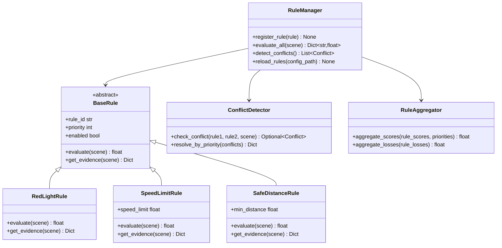

# 详细设计：BIZ-003 多规则语义注入

## A. 需求概述

### 需求编号
- 业务需求：BIZ-003
- 系统需求：SYS-F-004
- 当前完成度：15%（仅有红灯单规则）

### 业务价值
- 扩展规则引擎，支持多种交通规则（车速限制、车道保持、安全距离等）
- 提供规则DSL框架，便于业务方配置和扩展规则
- 检测规则冲突，确保多规则协同工作
- 支持规则热更新，无需重启系统

### 验收标准
- ✅ 支持≥3条交通规则（红灯停、车速限制、安全距离）
- ✅ 规则可通过配置文件定义（Python配置类）
- ✅ 自动检测规则冲突并报警
- ✅ 规则优先级机制（高优先级规则覆盖低优先级）
- ✅ 每条规则均生成独立约束损失，可在日志中追踪
- ✅ 规则热更新（reload_rules方法）

## B. 架构设计

### 组件图



### 序列图

```mermaid
sequenceDiagram
    participant Trainer
    participant RuleManager
    participant RedLightRule
    participant SpeedLimitRule
    participant ConflictDetector
    participant Aggregator
    
    Trainer->>RuleManager: evaluate_all(scene)
    
    RuleManager->>RedLightRule: evaluate(scene)
    RedLightRule-->>RuleManager: score1=0.85
    
    RuleManager->>SpeedLimitRule: evaluate(scene)
    SpeedLimitRule-->>RuleManager: score2=0.30
    
    RuleManager->>ConflictDetector: check_conflicts([rule1, rule2], scene)
    ConflictDetector-->>RuleManager: conflicts=[]
    
    RuleManager->>Aggregator: aggregate([score1, score2], [p1, p2])
    Aggregator-->>RuleManager: final_score=0.65
    
    RuleManager-->>Trainer: {
        'final_score': 0.65,
        'rule_scores': {'red_light': 0.85, 'speed_limit': 0.30},
        'conflicts': []
    }
```

## C. 接口设计

### C.1 规则基类

```python
from abc import ABC, abstractmethod
from dataclasses import dataclass
from typing import Dict, Any

@dataclass
class RuleConfig:
    """规则配置基类"""
    rule_id: str
    priority: int = 100  # 优先级，数字越大越优先
    enabled: bool = True
    weight: float = 1.0  # 聚合时的权重

class BaseRule(ABC):
    """
    交通规则基类
    
    所有规则必须继承此类并实现evaluate方法
    """
    
    def __init__(self, config: RuleConfig):
        """
        初始化规则
        
        Args:
            config: 规则配置
        """
        self.config = config
        self.rule_id = config.rule_id
        self.priority = config.priority
        self.enabled = config.enabled
        self.weight = config.weight
    
    @abstractmethod
    def evaluate(
        self,
        scene: SceneContext,
        entity_idx: Optional[int] = None,  # 如果是针对单个实体的规则
    ) -> torch.Tensor:
        """
        评估规则违规分数
        
        Args:
            scene: 场景上下文
            entity_idx: 实体索引（可选，如果规则针对特定实体）
        
        Returns:
            scores: 违规分数 [N_entities] 或标量
        """
        pass
    
    @abstractmethod
    def get_evidence(
        self,
        scene: SceneContext,
        scores: torch.Tensor,
    ) -> Dict[str, Any]:
        """
        获取违规证据
        
        Args:
            scene: 场景上下文
            scores: 评分结果
        
        Returns:
            evidence: 证据字典，包含可解释的违规依据
        """
        pass
    
    def is_applicable(self, scene: SceneContext) -> bool:
        """
        判断规则是否适用于当前场景
        
        Returns:
            applicable: 是否适用
        """
        return self.enabled
```

### C.2 新增规则示例：车速限制

```python
@dataclass
class SpeedLimitRuleConfig(RuleConfig):
    """车速限制规则配置"""
    speed_limit: float = 13.89  # 50 km/h = 13.89 m/s
    tolerance: float = 1.0      # 容忍度（m/s）

class SpeedLimitRule(BaseRule):
    """
    车速限制规则
    
    规则逻辑：
        - 如果车辆速度 > speed_limit + tolerance，则违规
        - 违规分数与超速程度成正比
    """
    
    def __init__(self, config: SpeedLimitRuleConfig):
        super().__init__(config)
        self.speed_limit = config.speed_limit
        self.tolerance = config.tolerance
    
    def evaluate(
        self,
        scene: SceneContext,
        entity_idx: Optional[int] = None,
    ) -> torch.Tensor:
        """
        评估车速违规
        
        Returns:
            scores: [N_cars] 违规分数
        """
        cars = scene.get_entities_by_type('car')
        velocities = torch.tensor([c.velocity for c in cars], dtype=torch.float32)
        
        # 超速量
        excess_speed = velocities - (self.speed_limit + self.tolerance)
        
        # 违规分数：sigmoid映射到[0,1]
        scores = torch.sigmoid(excess_speed / 5.0)  # 5.0为敏感度参数
        scores = torch.clamp(scores, 0, 1)
        
        return scores
    
    def get_evidence(
        self,
        scene: SceneContext,
        scores: torch.Tensor,
    ) -> Dict[str, Any]:
        """
        获取超速证据
        
        Returns:
            evidence: {
                'rule_id': 'speed_limit',
                'speed_limit': 13.89,
                'violations': [
                    {'entity_id': 'car_0', 'speed': 18.5, 'excess': 4.61, 'score': 0.87},
                    ...
                ]
            }
        """
        cars = scene.get_entities_by_type('car')
        violations = []
        
        for idx, (car, score) in enumerate(zip(cars, scores)):
            if score > 0.5:
                violations.append({
                    'entity_id': car.id,
                    'speed': car.velocity,
                    'speed_limit': self.speed_limit,
                    'excess': car.velocity - self.speed_limit,
                    'score': float(score),
                })
        
        return {
            'rule_id': self.rule_id,
            'speed_limit': self.speed_limit,
            'violations': violations,
        }
```

### C.3 规则管理器

```python
class RuleManager:
    """
    规则管理器：注册、执行、聚合多条规则
    
    功能：
        - 规则注册与动态加载
        - 多规则并行评估
        - 冲突检测与解决
        - 规则分数聚合
    """
    
    def __init__(self):
        """初始化规则管理器"""
        self.rules: Dict[str, BaseRule] = {}  # {rule_id: rule_instance}
        self.conflict_detector = ConflictDetector()
        self.aggregator = RuleAggregator()
    
    def register_rule(self, rule: BaseRule) -> None:
        """
        注册规则
        
        Args:
            rule: 规则实例
        """
        self.rules[rule.rule_id] = rule
        print(f"[RuleManager] 注册规则：{rule.rule_id}（优先级={rule.priority}）")
    
    def evaluate_all(
        self,
        scene: SceneContext,
    ) -> Dict[str, Any]:
        """
        评估所有规则
        
        Args:
            scene: 场景上下文
        
        Returns:
            result: {
                'final_score': float,          # 聚合后的最终分数
                'rule_scores': {rule_id: score},  # 各规则分数
                'rule_evidences': {rule_id: evidence},
                'conflicts': [Conflict],
            }
        """
        rule_scores = {}
        rule_evidences = {}
        
        # 1. 评估所有启用的规则
        for rule_id, rule in self.rules.items():
            if not rule.enabled or not rule.is_applicable(scene):
                continue
            
            scores = rule.evaluate(scene)
            evidence = rule.get_evidence(scene, scores)
            
            rule_scores[rule_id] = scores
            rule_evidences[rule_id] = evidence
        
        # 2. 冲突检测
        conflicts = self.conflict_detector.detect_all(
            self.rules, scene, rule_scores
        )
        
        # 3. 解决冲突（按优先级）
        if conflicts:
            resolved_scores = self.conflict_detector.resolve_by_priority(
                rule_scores, self.rules, conflicts
            )
        else:
            resolved_scores = rule_scores
        
        # 4. 聚合分数
        final_score = self.aggregator.aggregate_scores(
            resolved_scores,
            {rid: self.rules[rid].weight for rid in resolved_scores.keys()},
        )
        
        return {
            'final_score': final_score,
            'rule_scores': rule_scores,
            'rule_evidences': rule_evidences,
            'conflicts': conflicts,
        }
    
    def reload_rules(self, config_path: Path) -> None:
        """
        热更新规则配置
        
        Args:
            config_path: 规则配置文件路径
        """
        # 加载新配置
        new_config = load_rule_config(config_path)
        
        # 清空旧规则
        self.rules.clear()
        
        # 注册新规则
        for rule_config in new_config:
            rule_class = get_rule_class(rule_config.rule_type)
            rule_instance = rule_class(rule_config)
            self.register_rule(rule_instance)
        
        print(f"[RuleManager] 规则热更新完成：{len(self.rules)}条规则")
```

### C.4 冲突检测器

```python
@dataclass
class Conflict:
    """规则冲突数据结构"""
    rule1_id: str
    rule2_id: str
    conflict_type: str  # 'score_divergence' | 'logic_contradiction'
    severity: float     # 冲突严重程度 [0, 1]
    scene_id: str
    description: str

class ConflictDetector:
    """
    规则冲突检测器
    
    冲突类型：
        1. 分数分歧：两规则对同一实体给出差异很大的分数（|s1 - s2| > 0.5）
        2. 逻辑矛盾：两规则的语义互相矛盾（如"必须停车"与"必须前进"）
    """
    
    def detect_all(
        self,
        rules: Dict[str, BaseRule],
        scene: SceneContext,
        rule_scores: Dict[str, torch.Tensor],
    ) -> List[Conflict]:
        """
        检测所有规则间的冲突
        
        Args:
            rules: 规则字典
            scene: 场景上下文
            rule_scores: 各规则的评分结果
        
        Returns:
            conflicts: 冲突列表
        """
        conflicts = []
        rule_ids = list(rules.keys())
        
        # 两两检查
        for i in range(len(rule_ids)):
            for j in range(i + 1, len(rule_ids)):
                rid1, rid2 = rule_ids[i], rule_ids[j]
                
                conflict = self.check_score_divergence(
                    rid1, rid2,
                    rule_scores.get(rid1),
                    rule_scores.get(rid2),
                    scene,
                )
                
                if conflict:
                    conflicts.append(conflict)
        
        return conflicts
    
    def check_score_divergence(
        self,
        rid1: str, rid2: str,
        scores1: torch.Tensor,
        scores2: torch.Tensor,
        scene: SceneContext,
        threshold: float = 0.5,
    ) -> Optional[Conflict]:
        """
        检测分数分歧冲突
        
        Args:
            rid1, rid2: 规则ID
            scores1, scores2: 两规则的分数（可能shape不同）
            scene: 场景上下文
            threshold: 分歧阈值
        
        Returns:
            conflict: 如果检测到冲突则返回，否则None
        """
        if scores1 is None or scores2 is None:
            return None
        
        # 如果两规则针对不同实体，不检测冲突
        if scores1.shape != scores2.shape:
            return None
        
        # 计算分数差异
        divergence = torch.abs(scores1 - scores2).max().item()
        
        if divergence > threshold:
            return Conflict(
                rule1_id=rid1,
                rule2_id=rid2,
                conflict_type='score_divergence',
                severity=divergence,
                scene_id=scene.scene_id,
                description=f"规则{rid1}与{rid2}分数差异={divergence:.2f}（阈值={threshold}）",
            )
        
        return None
    
    def resolve_by_priority(
        self,
        rule_scores: Dict[str, torch.Tensor],
        rules: Dict[str, BaseRule],
        conflicts: List[Conflict],
    ) -> Dict[str, torch.Tensor]:
        """
        按优先级解决冲突
        
        策略：高优先级规则的分数覆盖低优先级规则
        
        Args:
            rule_scores: 原始规则分数
            rules: 规则字典
            conflicts: 冲突列表
        
        Returns:
            resolved_scores: 解决冲突后的分数
        """
        resolved = rule_scores.copy()
        
        for conflict in conflicts:
            rid1, rid2 = conflict.rule1_id, conflict.rule2_id
            p1, p2 = rules[rid1].priority, rules[rid2].priority
            
            # 保留高优先级规则的分数
            if p1 < p2:
                print(f"[冲突解决] {rid1}（优先级{p1}）被{rid2}（优先级{p2}）覆盖")
                resolved.pop(rid1, None)
            elif p2 < p1:
                print(f"[冲突解决] {rid2}（优先级{p2}）被{rid1}（优先级{p1}）覆盖")
                resolved.pop(rid2, None)
        
        return resolved
```

### C.5 规则聚合器

```python
class RuleAggregator:
    """
    规则分数聚合器
    
    支持多种聚合策略：
        - weighted_sum: 加权求和
        - max_pooling: 取最大值（最严重违规）
        - voting: 多数投票（二值化后）
    """
    
    def __init__(self, strategy: str = 'weighted_sum'):
        """
        初始化聚合器
        
        Args:
            strategy: 聚合策略 ('weighted_sum' | 'max_pooling' | 'voting')
        """
        self.strategy = strategy
    
    def aggregate_scores(
        self,
        rule_scores: Dict[str, torch.Tensor],
        rule_weights: Dict[str, float],
    ) -> torch.Tensor:
        """
        聚合多条规则的分数
        
        Args:
            rule_scores: {rule_id: scores}
            rule_weights: {rule_id: weight}
        
        Returns:
            final_scores: 聚合后的分数
        """
        if not rule_scores:
            return torch.tensor(0.0)
        
        if self.strategy == 'weighted_sum':
            # 加权求和（需要归一化权重）
            total_weight = sum(rule_weights.values())
            weighted_scores = [
                rule_scores[rid] * (rule_weights[rid] / total_weight)
                for rid in rule_scores.keys()
            ]
            return torch.stack(weighted_scores).sum(dim=0)
        
        elif self.strategy == 'max_pooling':
            # 取最大值（最严重违规）
            all_scores = torch.stack(list(rule_scores.values()))
            return all_scores.max(dim=0)[0]
        
        elif self.strategy == 'voting':
            # 投票：多数规则判为违规则判为违规
            threshold = 0.5
            votes = torch.stack([
                (rule_scores[rid] > threshold).float()
                for rid in rule_scores.keys()
            ])
            return (votes.sum(dim=0) / len(rule_scores)) > 0.5
        
        else:
            raise ValueError(f"不支持的聚合策略：{self.strategy}")
```

## D. 算法设计

### D.1 规则冲突检测算法

**输入**：N条规则，场景数据
**输出**：冲突列表

**伪代码**：
```
function detect_conflicts(rules, scene):
    conflicts = []
    
    // 两两检查
    for i in range(len(rules)):
        for j in range(i+1, len(rules)):
            rule1, rule2 = rules[i], rules[j]
            
            // 类型1：分数分歧冲突
            scores1 = rule1.evaluate(scene)
            scores2 = rule2.evaluate(scene)
            
            if shape(scores1) == shape(scores2):
                divergence = max(abs(scores1 - scores2))
                if divergence > 0.5:
                    conflicts.append(Conflict(
                        rule1, rule2,
                        type='score_divergence',
                        severity=divergence,
                    ))
            
            // 类型2：逻辑矛盾冲突（需要规则元数据）
            if check_logic_contradiction(rule1, rule2):
                conflicts.append(Conflict(
                    rule1, rule2,
                    type='logic_contradiction',
                    severity=1.0,
                ))
    
    return conflicts
```

**复杂度**：O(N^2 × M)，N=规则数，M=实体数

### D.2 优先级冲突解决算法

**输入**：冲突列表，规则优先级
**输出**：解决后的规则分数字典

**伪代码**：
```
function resolve_conflicts(conflicts, rules, rule_scores):
    resolved_scores = copy(rule_scores)
    
    for conflict in conflicts:
        rule1_id, rule2_id = conflict.rule1_id, conflict.rule2_id
        p1, p2 = rules[rule1_id].priority, rules[rule2_id].priority
        
        // 移除低优先级规则的分数
        if p1 < p2:
            resolved_scores.remove(rule1_id)
            log_warning(f"{rule1_id}被{rule2_id}覆盖（优先级{p1} < {p2}）")
        else if p2 < p1:
            resolved_scores.remove(rule2_id)
            log_warning(f"{rule2_id}被{rule1_id}覆盖（优先级{p2} < {p1}）")
        else:
            // 优先级相同：报错或使用其他策略（如平均）
            log_error(f"{rule1_id}与{rule2_id}优先级相同（{p1}），无法自动解决")
    
    return resolved_scores
```

## E. 数据设计

### E.1 规则配置文件格式

**文件**：`src/traffic_rules/config/rules_config.py`（Python配置）

```python
# 规则配置示例
RULES_CONFIG = [
    {
        'rule_type': 'red_light',
        'rule_id': 'red_light_stop',
        'priority': 100,
        'enabled': True,
        'weight': 1.0,
        'params': {
            'tau_d': 5.0,
            'tau_v': 0.5,
            'alpha_d': 2.0,
            'alpha_v': 5.0,
        },
    },
    {
        'rule_type': 'speed_limit',
        'rule_id': 'speed_limit_urban',
        'priority': 80,
        'enabled': True,
        'weight': 0.8,
        'params': {
            'speed_limit': 13.89,  # 50 km/h
            'tolerance': 1.0,
        },
    },
    {
        'rule_type': 'safe_distance',
        'rule_id': 'safe_distance_following',
        'priority': 60,
        'enabled': True,
        'weight': 0.6,
        'params': {
            'min_distance': 10.0,  # 米
        },
    },
]
```

### E.2 冲突报告格式

**文件**：`reports/rule_conflicts.json`

```json
{
  "检测时间": "2025-12-16 10:00:00",
  "场景数": 20,
  "冲突总数": 3,
  "冲突详情": [
    {
      "conflict_id": "conflict_001",
      "scene_id": "scene_005",
      "rule1": "red_light_stop",
      "rule2": "speed_limit_urban",
      "type": "score_divergence",
      "severity": 0.65,
      "description": "红灯规则分数0.90，车速规则分数0.25，差异过大",
      "resolution": "保留red_light_stop（优先级100 > 80）"
    }
  ]
}
```

## F. 依赖关系

### F.1 依赖模块
- `src/traffic_rules/rules/red_light.py` - 红灯规则（已有）
- `src/traffic_rules/data/` - SceneContext数据结构（已有）
- 新增依赖：无（纯Python实现）

### F.2 被依赖关系
- 被 `src/traffic_rules/loss/constraint.py` 调用（多规则约束损失）
- 被 `tools/train_red_light.py` 调用（训练时规则评分）

## G. 实施计划

### G.1 任务分解

#### 任务1：设计规则基类与管理器（1天）
**文件**：新增 `src/traffic_rules/rules/base_rule.py`、`src/traffic_rules/rules/rule_manager.py`

**实施步骤**：
1. 定义`BaseRule`抽象类
2. 定义`RuleConfig`数据类
3. 实现`RuleManager`类
4. 实现`ConflictDetector`类
5. 实现`RuleAggregator`类

**交付物**：
- `src/traffic_rules/rules/base_rule.py`
- `src/traffic_rules/rules/rule_manager.py`

#### 任务2：重构红灯规则为BaseRule子类（0.5天）
**文件**：修改 `src/traffic_rules/rules/red_light.py`

**修改**：
```python
class RedLightRule(BaseRule):
    def __init__(self, config: RedLightRuleConfig):
        super().__init__(config)
        self.tau_d = config.params['tau_d']
        ...
    
    def evaluate(self, scene: SceneContext) -> torch.Tensor:
        # 保留现有逻辑，包装为BaseRule接口
        ...
    
    def get_evidence(self, scene: SceneContext, scores: torch.Tensor) -> Dict:
        ...
```

#### 任务3：实现新规则（车速限制、安全距离）（2天）
**文件**：
- `src/traffic_rules/rules/speed_limit.py`
- `src/traffic_rules/rules/safe_distance.py`

**实施**：
1. 定义`SpeedLimitRule`类（见C.2节）
2. 定义`SafeDistanceRule`类（跟车距离检测）
3. 添加单元测试

**交付物**：
- 2个新规则文件
- 对应单元测试

#### 任务4：集成到训练循环（1天）
**文件**：修改 `tools/train_red_light.py`、`src/traffic_rules/loss/constraint.py`

**修改点**：
1. 在Trainer中使用RuleManager替代RedLightRuleEngine
2. 在损失计算中支持多规则分数
3. 在日志中记录各规则分数

**验证**：
```bash
python3 tools/train_red_light.py train \
  --epochs 10 \
  --rules red_light,speed_limit \
  --device cpu

# 检查日志是否包含各规则分数
cat logs/training.log | grep "rule_scores"
```

#### 任务5：实现规则配置加载（0.5天）
**文件**：扩展 `src/traffic_rules/config/loader.py`

**修改**：
```python
class RulesConfig(BaseModel):
    rules: List[Dict[str, Any]]  # 规则配置列表
    aggregation_strategy: str = 'weighted_sum'
    detect_conflicts: bool = True

# 在ProjectConfig中添加
class ProjectConfig(BaseModel):
    ...
    rules_config: RulesConfig = Field(default_factory=RulesConfig)
```

### G.2 优先级排序
1. **任务1**（基类与管理器）- P0，框架基础
2. **任务2**（重构红灯规则）- P0，保持兼容
3. **任务3**（新规则）- P1，功能扩展
4. **任务4**（集成）- P1，打通流程
5. **任务5**（配置）- P2，便利性

### G.3 工作量估算
- 任务1：1人日
- 任务2：0.5人日
- 任务3：2人日
- 任务4：1人日
- 任务5：0.5人日
- **总计**：5人日（约1周）

### G.4 实施顺序
```
Day 1: 任务1（基类与管理器）
Day 2: 任务2（重构红灯） + 任务5（配置）
Day 3-4: 任务3（新规则实现）
Day 5: 任务4（集成训练） + 测试
```

## H. 规则DSL示例

### H.1 车速限制规则

**数学定义**：
$$
s_{\text{speed}}(v) = \sigma\left(\frac{v - (v_{\text{limit}} + \tau)}{5.0}\right)
$$

其中：
- $v$：车辆速度（m/s）
- $v_{\text{limit}}$：速度限制（如13.89 m/s = 50 km/h）
- $\tau$：容忍度（如1.0 m/s）

**物理意义**：
- $v \le v_{\text{limit}} + \tau$：无违规，分数≈0
- $v > v_{\text{limit}} + \tau$：违规，分数随超速量增加

### H.2 安全距离规则

**数学定义**：
$$
s_{\text{safe}}(d) = \sigma\left(\frac{d_{\text{min}} - d}{3.0}\right)
$$

其中：
- $d$：前车距离（m）
- $d_{\text{min}}$：最小安全距离（如10m）

**物理意义**：
- $d \ge d_{\text{min}}$：安全，分数≈0
- $d < d_{\text{min}}$：距离不足，分数随距离减小而增加

## I. 验证标准

- ✅ 可以注册多条规则（≥3条）
- ✅ 规则可单独启用/禁用
- ✅ 自动检测并报告冲突
- ✅ 按优先级解决冲突
- ✅ 每条规则的分数可在日志中追踪
- ✅ 支持规则热更新（reload_rules）

## J. 扩展性考虑

### J.1 未来可扩展的规则类型
- 车道保持规则（检测车辆是否在车道内）
- 行人优先规则（斑马线前减速）
- 转向信号规则（转弯前打灯）
- 停车规则（禁停区检测）

### J.2 规则DSL语法设计（可选，高级功能）
```yaml
# 未来可以考虑YAML DSL（当前阶段用Python配置即可）
rules:
  - id: red_light_stop
    type: traffic_light
    priority: 100
    condition:
      light_state: red
      distance: < 5m
      velocity: > 0.5m/s
    score_formula: "sigmoid(alpha_d * (tau_d - d)) * sigmoid(alpha_v * v)"
```

## K. 参考资料
- 规则引擎模式：https://martinfowler.com/bliki/RulesEngine.html
- 冲突检测：Conflict Detection in Rule-Based Systems
- 已有实现：`src/traffic_rules/rules/red_light.py`
