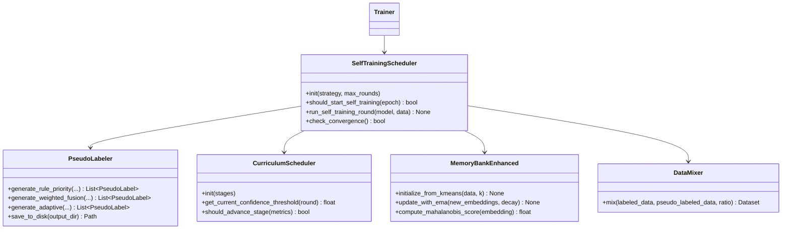
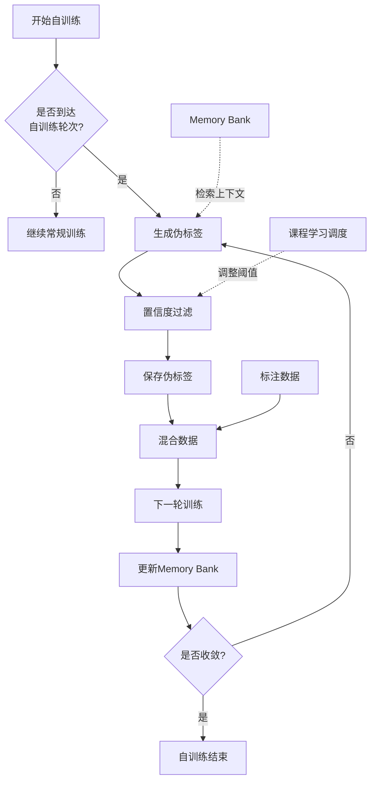

# 详细设计：BIZ-004 自训练与记忆增强

## A. 需求概述

### 需求编号
- 业务需求：BIZ-004
- 系统需求：SYS-F-005
- 当前完成度：40%（模块完成，未集成）

### 业务价值
- 利用无标注数据进行自训练，减少人工标注成本
- 通过记忆库学习正常驾驶模式，提升异常检测准确率
- 支持课程学习，从高置信度样本逐步扩展到低置信度样本

### 验收标准
- ✅ 自训练轮次可配置（通过命令行参数）
- ✅ 伪标签生成策略可选（rule_priority / weighted_fusion / adaptive）
- ✅ Memory Bank可持久化与加载
- ✅ 记忆检索命中率指标输出（在训练日志中）
- ✅ 自训练收敛判定（连续N轮伪标签一致性>阈值）

## B. 架构设计

### 组件图



### 数据流图



## C. 接口设计

### C.1 自训练调度器

```python
class SelfTrainingScheduler:
    """
    自训练调度器：控制自训练的启动、轮次、收敛
    
    设计模式：策略模式（可切换不同自训练策略）
    """
    
    def __init__(
        self,
        strategy: str = 'rule_priority',
        start_epoch: int = 30,  # 从第30个epoch开始自训练
        max_rounds: int = 5,    # 最多5轮自训练
        convergence_threshold: float = 0.95,  # 伪标签一致性>95%则收敛
        curriculum: Optional[CurriculumScheduler] = None,
    ):
        """
        初始化调度器
        
        Args:
            strategy: 伪标签策略 ('rule_priority' | 'weighted_fusion' | 'adaptive')
            start_epoch: 开始自训练的epoch
            max_rounds: 最大自训练轮次
            convergence_threshold: 收敛阈值
            curriculum: 课程学习调度器（可选）
        """
        self.strategy = strategy
        self.start_epoch = start_epoch
        self.max_rounds = max_rounds
        self.convergence_threshold = convergence_threshold
        self.curriculum = curriculum
        
        self.current_round = 0
        self.history = []  # 记录每轮伪标签统计
    
    def should_start_self_training(self, epoch: int) -> bool:
        """
        判断是否应该启动自训练
        
        Args:
            epoch: 当前epoch
        
        Returns:
            should_start: 是否启动
        """
        return (
            epoch >= self.start_epoch and
            self.current_round < self.max_rounds
        )
    
    def run_self_training_round(
        self,
        model: nn.Module,
        unlabeled_dataset: Dataset,
        rule_engine: RedLightRuleEngine,
        graph_builder: GraphBuilder,
        device: str = 'cpu',
    ) -> Tuple[List[PseudoLabel], Dict[str, float]]:
        """
        运行一轮自训练
        
        Args:
            model: 当前训练好的模型
            unlabeled_dataset: 未标注数据集
            rule_engine: 规则引擎
            graph_builder: 图构建器
            device: 设备
        
        Returns:
            pseudo_labels: 生成的伪标签列表
            stats: 统计信息 {'total': 100, 'accepted': 65, 'confidence_avg': 0.89, ...}
        """
        # 1. 模型推理获取分数
        model.eval()
        model_scores_all = []
        rule_scores_all = []
        attention_all = []
        scene_ids = []
        entity_ids = []
        
        with torch.no_grad():
            for idx in range(len(unlabeled_dataset)):
                scene = unlabeled_dataset[idx]
                graph = graph_builder.build(scene)
                
                x = graph.x.to(device)
                edge_index = graph.edge_index.to(device)
                entity_types = graph.entity_types.to(device)
                
                if edge_index.size(1) == 0:
                    continue
                
                output = model(x, edge_index, entity_types, return_attention=True)
                
                car_entities = scene.get_entities_by_type('car')
                if len(car_entities) == 0:
                    continue
                
                # 规则评分
                light_probs = get_light_probs(scene.entities)
                distances = torch.tensor([e.d_stop for e in car_entities])
                velocities = torch.tensor([e.velocity for e in car_entities])
                rule_scores = rule_engine.evaluate(light_probs, distances, velocities, training=False)
                
                # 收集
                model_scores_all.append(output['scores'])
                rule_scores_all.append(rule_scores)
                attention_all.append(output['gat_attention'].max())  # 简化：取最大注意力
                scene_ids.extend([scene.scene_id] * len(car_entities))
                entity_ids.extend([e.id for e in car_entities])
        
        # 2. 调用PseudoLabeler生成伪标签
        labeler = PseudoLabeler(
            strategy=self.strategy,
            threshold_conf=self.curriculum.get_threshold() if self.curriculum else 0.85,
            threshold_consistency=0.2,
        )
        
        model_scores_cat = torch.cat(model_scores_all)
        rule_scores_cat = torch.cat(rule_scores_all)
        attention_cat = torch.stack(attention_all)
        
        if self.strategy == 'rule_priority':
            pseudo_labels = labeler.generate_rule_priority(
                model_scores_cat, rule_scores_cat, attention_cat,
                scene_ids, entity_ids,
            )
        elif self.strategy == 'weighted_fusion':
            pseudo_labels = labeler.generate_weighted_fusion(
                model_scores_cat, rule_scores_cat,
                scene_ids, entity_ids,
            )
        elif self.strategy == 'adaptive':
            pseudo_labels = labeler.generate_adaptive(
                model_scores_cat, rule_scores_cat, attention_cat,
                scene_ids, entity_ids,
            )
        
        # 3. 统计
        stats = {
            'total': len(model_scores_cat),
            'accepted': len(pseudo_labels),
            'confidence_avg': np.mean([pl.confidence for pl in pseudo_labels]) if pseudo_labels else 0.0,
            'violation_ratio': sum(1 for pl in pseudo_labels if pl.label == 1) / max(len(pseudo_labels), 1),
        }
        
        # 4. 记录历史
        self.history.append(stats)
        self.current_round += 1
        
        return pseudo_labels, stats
    
    def check_convergence(self) -> bool:
        """
        检查是否收敛
        
        判据：连续2轮伪标签一致性 > 阈值
        
        Returns:
            converged: 是否已收敛
        """
        if len(self.history) < 2:
            return False
        
        # 简化判定：连续2轮accepted数量变化<5%
        recent = self.history[-2:]
        change_rate = abs(recent[1]['accepted'] - recent[0]['accepted']) / max(recent[0]['accepted'], 1)
        
        return change_rate < 0.05
```

### C.2 课程学习调度器

```python
class CurriculumScheduler:
    """
    课程学习调度器：动态调整伪标签置信度阈值
    
    策略：从高置信度（0.9）逐步降到中等置信度（0.7）
    """
    
    def __init__(
        self,
        initial_threshold: float = 0.9,
        final_threshold: float = 0.7,
        decay_rate: float = 0.95,
    ):
        """
        初始化调度器
        
        Args:
            initial_threshold: 初始置信度阈值（高）
            final_threshold: 最终置信度阈值（中）
            decay_rate: 每轮衰减率
        """
        self.initial_threshold = initial_threshold
        self.final_threshold = final_threshold
        self.decay_rate = decay_rate
        self.current_threshold = initial_threshold
    
    def get_threshold(self) -> float:
        """获取当前阈值"""
        return self.current_threshold
    
    def step(self) -> None:
        """
        每轮自训练后调用：降低阈值
        
        公式：threshold_t = max(final, initial * decay^t)
        """
        self.current_threshold = max(
            self.final_threshold,
            self.current_threshold * self.decay_rate,
        )
    
    def should_advance_stage(self, metrics: Dict[str, float]) -> bool:
        """
        判断是否应该进入下一阶段（降低阈值）
        
        判据：当前阶段的伪标签accepted数量稳定
        
        Args:
            metrics: 本轮自训练统计
        
        Returns:
            should_advance: 是否进入下一阶段
        """
        # 简化判定：如果accepted数量 > 50，则可以降低阈值扩大样本池
        return metrics.get('accepted', 0) > 50
```

### C.3 Memory Bank 增强版

```python
class MemoryBankEnhanced(MemoryBank):
    """
    增强版Memory Bank：增加K-Means初始化和EMA更新
    
    继承自：src/traffic_rules/memory/memory_bank.py::MemoryBank
    """
    
    def initialize_from_kmeans(
        self,
        embeddings: torch.Tensor,  # [M, D] 正常样本embeddings
        k: Optional[int] = None,
    ) -> None:
        """
        使用K-Means初始化Memory Bank
        
        Args:
            embeddings: 正常样本的embeddings
            k: 聚类数量（默认=self.size）
        
        Algorithm:
            1. 对embeddings进行K-Means聚类（k=memory_size）
            2. 将k个聚类中心作为初始记忆
        """
        from sklearn.cluster import KMeans
        
        k = k or self.size
        embeddings_np = embeddings.detach().cpu().numpy()
        
        # K-Means聚类
        kmeans = KMeans(n_clusters=k, random_state=42, n_init=10)
        kmeans.fit(embeddings_np)
        
        # 将聚类中心存入memory
        centers = torch.from_numpy(kmeans.cluster_centers_).float()
        self.storage[:k] = centers
        
        print(f"[MemoryBank] K-Means初始化完成：{k}个聚类中心")
    
    def update_with_ema(
        self,
        new_embeddings: torch.Tensor,  # [N, D] 新的正常样本embeddings
        ema_decay: float = 0.99,
    ) -> None:
        """
        使用EMA更新Memory Bank
        
        Args:
            new_embeddings: 新的正常样本embeddings
            ema_decay: EMA衰减率（默认0.99，缓慢更新）
        
        Algorithm:
            1. 对每个new_embedding，找到最近的记忆槽
            2. 用EMA更新：memory_i = ema_decay * memory_i + (1 - ema_decay) * new_emb
        """
        if not torch.any(self.storage):
            # 如果memory未初始化，直接存储前N个
            n = min(new_embeddings.size(0), self.size)
            self.storage[:n] = new_embeddings[:n]
            return
        
        for emb in new_embeddings:
            # 找到最近的记忆槽（余弦相似度）
            sim = F.cosine_similarity(
                emb.unsqueeze(0),
                self.storage,
                dim=1,
            )
            nearest_idx = sim.argmax()
            
            # EMA更新
            self.storage[nearest_idx] = (
                ema_decay * self.storage[nearest_idx] +
                (1 - ema_decay) * emb
            )
    
    def compute_mahalanobis_score(
        self,
        embeddings: torch.Tensor,  # [N, D]
    ) -> torch.Tensor:  # [N] 异常分数
        """
        计算马氏距离异常分数（可选高级功能）
        
        Formula:
            score_i = sqrt((x_i - μ)^T Σ^{-1} (x_i - μ))
            其中 μ = mean(memory), Σ = cov(memory)
        
        Returns:
            anomaly_scores: [N] 分数越高越异常
        """
        if not torch.any(self.storage):
            return torch.zeros(embeddings.size(0))
        
        # 计算均值和协方差
        mu = self.storage.mean(dim=0)
        centered = self.storage - mu
        cov = (centered.T @ centered) / (self.storage.size(0) - 1)
        
        # 添加正则化避免奇异
        cov_reg = cov + torch.eye(cov.size(0)) * 1e-4
        cov_inv = torch.linalg.inv(cov_reg)
        
        # 计算马氏距离
        diff = embeddings - mu
        mahal_dist = torch.sqrt((diff @ cov_inv * diff).sum(dim=1))
        
        return mahal_dist
```

### C.4 数据混合器

```python
class DataMixer:
    """
    数据混合器：将标注数据与伪标注数据混合
    
    策略：
        - Stage 1: 100% 标注数据
        - Stage 2: 70% 标注 + 30% 伪标注
        - Stage 3: 50% 标注 + 50% 伪标注
    """
    
    def mix(
        self,
        labeled_dataset: Dataset,
        pseudo_labeled_dataset: Dataset,
        mix_ratio: float = 0.3,  # 伪标注比例
    ) -> Dataset:
        """
        混合数据集
        
        Args:
            labeled_dataset: 标注数据集
            pseudo_labeled_dataset: 伪标注数据集
            mix_ratio: 伪标注数据的比例
        
        Returns:
            mixed_dataset: 混合后的数据集
        """
        n_labeled = int(len(labeled_dataset) * (1 - mix_ratio))
        n_pseudo = int(len(pseudo_labeled_dataset) * mix_ratio)
        
        # 随机采样
        labeled_indices = random.sample(range(len(labeled_dataset)), n_labeled)
        pseudo_indices = random.sample(range(len(pseudo_labeled_dataset)), n_pseudo)
        
        # 合并
        mixed = ConcatDataset([
            Subset(labeled_dataset, labeled_indices),
            Subset(pseudo_labeled_dataset, pseudo_indices),
        ])
        
        return mixed
```

## D. 算法设计

### D.1 自训练主循环算法

**输入**：初始模型、无标注数据集、规则引擎
**输出**：自训练后的模型 + 伪标签数据

**伪代码**：
```
function self_training_loop(model, unlabeled_data, rule_engine, config):
    scheduler = SelfTrainingScheduler(
        strategy=config.strategy,
        start_epoch=config.start_epoch,
        max_rounds=config.max_rounds,
    )
    curriculum = CurriculumScheduler(initial=0.9, final=0.7)
    memory_bank = MemoryBankEnhanced(size=256, dim=128)
    
    // 初始化Memory Bank（使用前几个epoch的正常样本）
    normal_embeddings = extract_normal_embeddings(model, unlabeled_data[:100])
    memory_bank.initialize_from_kmeans(normal_embeddings, k=256)
    
    for round in range(config.max_rounds):
        print(f"自训练轮次 {round+1}/{config.max_rounds}")
        
        // Step 1: 生成伪标签
        pseudo_labels, stats = scheduler.run_self_training_round(
            model, unlabeled_data, rule_engine, graph_builder
        )
        
        print(f"  生成伪标签：{stats['accepted']} / {stats['total']}")
        
        // Step 2: 检查收敛
        if scheduler.check_convergence():
            print("  自训练已收敛，提前终止")
            break
        
        // Step 3: 混合数据
        pseudo_dataset = create_dataset_from_labels(pseudo_labels)
        mixed_dataset = DataMixer().mix(
            labeled_data, pseudo_dataset, mix_ratio=curriculum.get_mix_ratio(round)
        )
        
        // Step 4: 重新训练
        train_one_epoch(model, mixed_dataset)
        
        // Step 5: 更新Memory Bank
        new_normal_embeddings = extract_normal_embeddings(model, pseudo_dataset)
        memory_bank.update_with_ema(new_normal_embeddings, decay=0.99)
        
        // Step 6: 课程学习：降低阈值
        if curriculum.should_advance_stage(stats):
            curriculum.step()
            print(f"  课程学习：置信度阈值降低到 {curriculum.get_threshold()}")
    
    // 保存伪标签和Memory
    save_pseudo_labels(pseudo_labels, "artifacts/pseudo_labels/final.csv")
    memory_bank.save("artifacts/memory/memory_bank.pth")
    
    return model, pseudo_labels
```

**复杂度分析**：
- 时间：O(R × M × N)，R=轮次，M=未标注样本，N=模型推理时间
- 空间：O(M) 存储伪标签

### D.2 Memory Bank K-Means初始化算法

**输入**：正常样本embeddings [M, D]，聚类数K
**输出**：初始化的Memory Bank

**伪代码**：
```
function initialize_memory_kmeans(embeddings, k):
    // 使用sklearn K-Means
    kmeans = KMeans(n_clusters=k, random_state=42)
    kmeans.fit(embeddings)
    
    // 提取聚类中心
    centers = kmeans.cluster_centers_  // [K, D]
    
    // 存入memory storage
    memory_storage[:k] = torch.from_numpy(centers)
    
    return memory_storage
```

**复杂度**：O(M × K × I)，I为K-Means迭代次数

## E. 数据设计

### E.1 伪标签数据格式

**文件**：`artifacts/pseudo_labels/round_<N>.csv`

| scene_id | entity_id | label | confidence | model_score | rule_score | source | flag |
| --- | --- | --- | --- | --- | --- | --- | --- |
| scene_012 | car_0 | 1 | 0.92 | 0.89 | 0.95 | rule_priority | - |
| scene_015 | car_1 | 0 | 0.88 | 0.12 | 0.10 | rule_priority | - |
| scene_018 | car_0 | 1 | 0.75 | 0.82 | 0.65 | weighted_fusion | model_disagree |

### E.2 自训练历史日志

**文件**：`artifacts/self_training/history.json`

```json
{
  "strategy": "rule_priority",
  "start_epoch": 30,
  "max_rounds": 5,
  "rounds": [
    {
      "round": 1,
      "epoch": 30,
      "threshold_conf": 0.9,
      "total_samples": 1000,
      "accepted": 650,
      "confidence_avg": 0.92,
      "violation_ratio": 0.35,
      "consistency": 0.89
    },
    {
      "round": 2,
      "epoch": 40,
      "threshold_conf": 0.855,
      "total_samples": 1000,
      "accepted": 720,
      "confidence_avg": 0.90,
      "violation_ratio": 0.38,
      "consistency": 0.93
    }
  ],
  "converged_at_round": 4,
  "final_pseudo_label_path": "artifacts/pseudo_labels/round_4.csv"
}
```

### E.3 Memory Bank 状态文件

**文件**：`artifacts/memory/memory_bank.pth`

包含：
- `storage`: [K, D] Tensor - 记忆向量
- `metadata`: 元数据（初始化方法、更新轮次等）

## F. 依赖关系

### F.1 依赖模块
- `src/traffic_rules/self_training/pseudo_labeler.py` - 伪标签生成（已有）
- `src/traffic_rules/memory/memory_bank.py` - Memory基础类（已有）
- `src/traffic_rules/rules/red_light.py` - 规则评分（已有）
- `tools/train_red_light.py` - 训练循环（需修改集成）
- 新增依赖：`sklearn`（K-Means）

### F.2 被依赖关系
- 被训练流程调用（Trainer.train方法）
- 被模型推理使用（Memory Bank检索）

## G. 实施计划

### G.1 任务分解

#### 任务1：实现MemoryBank增强功能（2天）
**文件**：扩展 `src/traffic_rules/memory/memory_bank.py`

**修改点**：
1. 添加`initialize_from_kmeans`方法
2. 添加`update_with_ema`方法
3. （可选）添加`compute_mahalanobis_score`方法
4. 添加单元测试

**验证**：
```python
# 测试K-Means初始化
python3 -c "
from src.traffic_rules.memory.memory_bank import MemoryBank
import torch

bank = MemoryBank(size=10, embedding_dim=128)
normal_embs = torch.randn(100, 128)
bank.initialize_from_kmeans(normal_embs, k=10)
print('Memory初始化成功，存储形状:', bank.storage.shape)
"
```

#### 任务2：实现自训练调度器（2天）
**文件**：新增 `src/traffic_rules/self_training/scheduler.py`

**修改点**：
1. 实现`SelfTrainingScheduler`类
2. 实现`CurriculumScheduler`类
3. 实现`DataMixer`类
4. 添加单元测试

**交付物**：
- `src/traffic_rules/self_training/scheduler.py`
- `tests/unit/test_self_training_scheduler.py`

#### 任务3：集成到训练循环（1.5天）
**文件**：修改 `tools/train_red_light.py`

**修改点**：
1. 在Trainer.__init__中添加self_training参数
2. 在Trainer.train中添加自训练触发逻辑
3. 在适当epoch调用scheduler.run_self_training_round
4. 混合数据并继续训练
5. 记录自训练历史

**修改示例**：
```python
class Trainer:
    def __init__(
        self,
        ...,
        enable_self_training: bool = False,
        self_training_config: Optional[Dict] = None,
    ):
        ...
        if enable_self_training:
            self.self_training_scheduler = SelfTrainingScheduler(
                strategy=self_training_config.get('strategy', 'rule_priority'),
                start_epoch=self_training_config.get('start_epoch', 30),
                max_rounds=self_training_config.get('max_rounds', 5),
            )
        else:
            self.self_training_scheduler = None
    
    def train(self):
        for epoch in range(self.epochs):
            # 常规训练
            train_metrics = self.train_epoch()
            
            # 自训练触发
            if (self.self_training_scheduler and
                self.self_training_scheduler.should_start_self_training(epoch)):
                
                console.print("[cyan]启动自训练轮次...[/cyan]")
                pseudo_labels, stats = self.self_training_scheduler.run_self_training_round(
                    self.model, unlabeled_dataset, self.rule_engine, self.graph_builder, self.device
                )
                
                console.print(f"[green]生成伪标签：{stats['accepted']}/{stats['total']}[/green]")
                
                # TODO: 混合数据并重新创建DataLoader
                # TODO: 更新Memory Bank
```

**验证**：
```bash
python3 tools/train_red_light.py train \
  --epochs 50 \
  --enable-self-training \
  --self-training-start 30 \
  --self-training-rounds 3

# 检查输出
ls artifacts/pseudo_labels/round_*.csv
ls artifacts/memory/memory_bank.pth
cat artifacts/self_training/history.json
```

#### 任务4：添加Memory初始化命令（0.5天）
**文件**：`tools/train_red_light.py` 添加新命令

**修改**：
```python
@app.command()
def init_memory(
    data_root: str = "data/synthetic",
    split: str = "train",
    max_samples: int = 100,
    memory_size: int = 256,
    output: str = "artifacts/memory/initial.pth",
):
    """
    使用训练集正常样本初始化Memory Bank
    
    Example:
        python3 tools/train_red_light.py init-memory --max-samples 100
    """
    ...
```

### G.2 优先级排序
1. **任务1**（Memory增强）- P1，自训练基础
2. **任务2**（调度器）- P1，自训练核心
3. **任务3**（集成）- P1，打通流程
4. **任务4**（初始化命令）- P2，便利性

### G.3 工作量估算
- 任务1：2人日
- 任务2：2人日
- 任务3：1.5人日
- 任务4：0.5人日
- **总计**：6人日（约1.5周）

### G.4 实施顺序
```
Day 1-2: 任务1（Memory增强）
Day 3-4: 任务2（调度器）
Day 5-6: 任务3（集成）
Day 7: 任务4（初始化命令）+ 测试
```

## H. 验证标准

- ✅ Memory Bank可以用K-Means初始化
- ✅ Memory Bank可以用EMA更新
- ✅ 自训练可以配置启动epoch和轮次
- ✅ 课程学习阈值自动调整
- ✅ 自训练历史可追踪（JSON日志）
- ✅ 伪标签可持久化与加载

## I. 参考文献
- 伪标签策略：Pseudo-Label: The Simple and Efficient Semi-Supervised Learning Method (Lee, 2013)
- 课程学习：Curriculum Learning (Bengio et al., 2009)
- Memory Bank：MoCo (He et al., 2020)
- EMA更新：Mean Teacher (Tarvainen & Valpola, 2017)
