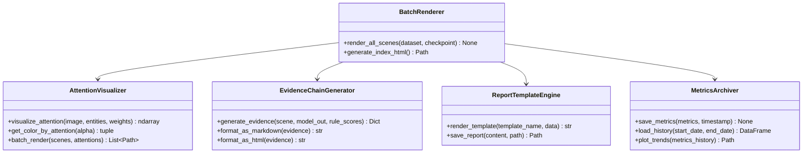
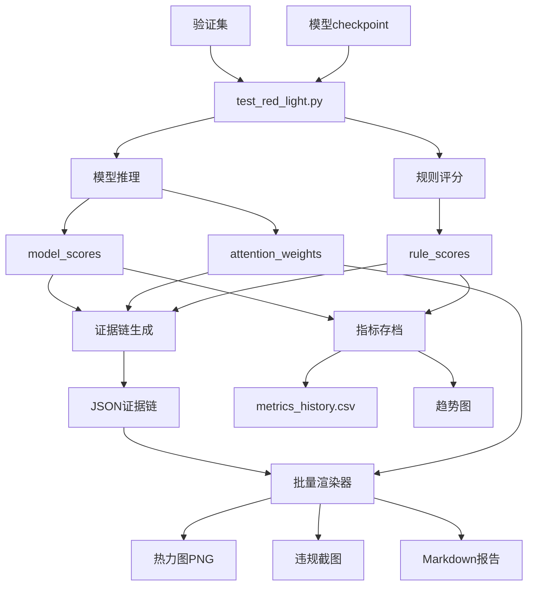

# 详细设计：SYS-F-006 可解释性输出完善

## A. 需求概述

### 需求编号
- 系统需求：SYS-F-006
- 关联业务需求：BIZ-005（可解释性与评估）
- 当前完成度：60%

### 业务价值
- 提供可解释的违规证据链，增强模型可信度
- 支持业务方/QA理解模型决策依据
- 为论文/开题报告提供可视化素材

### 验收标准
- ✅ 批量生成注意力热力图（validation集全部场景）
- ✅ 生成结构化违规证据链报告（Markdown或HTML）
- ✅ 指标持久化与历史追踪
- ✅ 报告模板统一，可重复生成

## B. 架构设计

### 组件图



### 数据流图



## C. 接口设计

### C.1 批量热力图渲染器

```python
class BatchAttentionRenderer:
    """
    批量注意力热力图渲染器
    
    功能：
        - 读取测试结果JSON
        - 为每个违规车辆生成热力图
        - 生成索引HTML（便于浏览）
    """
    
    def __init__(
        self,
        data_root: Path,
        evidence_dir: Path,
        output_dir: Path,
    ):
        """
        初始化渲染器
        
        Args:
            data_root: 数据根目录（用于加载原始场景）
            evidence_dir: 证据链JSON目录（test_red_light.py输出）
            output_dir: 热力图输出目录
        """
        self.data_root = Path(data_root)
        self.evidence_dir = Path(evidence_dir)
        self.output_dir = Path(output_dir)
        self.output_dir.mkdir(parents=True, exist_ok=True)
    
    def render_all(
        self,
        threshold: float = 0.7,
        max_scenes: Optional[int] = None,
    ) -> Dict[str, List[Path]]:
        """
        批量渲染所有场景的热力图
        
        Args:
            threshold: 违规判定阈值（只渲染违规车辆）
            max_scenes: 最大场景数（调试用）
        
        Returns:
            rendered_paths: {
                'scene_001': [heatmap_car_0.png, heatmap_car_1.png],
                'scene_002': [...],
                ...
            }
        """
        ...
    
    def generate_index_html(
        self,
        rendered_paths: Dict[str, List[Path]],
    ) -> Path:
        """
        生成热力图索引HTML（便于浏览）
        
        Returns:
            index_path: index.html路径
        """
        ...
```

### C.2 证据链报告生成器

```python
class EvidenceReportGenerator:
    """
    违规证据链报告生成器
    
    输入：场景JSON证据链
    输出：结构化Markdown或HTML报告
    """
    
    def __init__(self, template_path: Optional[Path] = None):
        """
        初始化报告生成器
        
        Args:
            template_path: 报告模板路径（可选，使用默认模板）
        """
        self.template_path = template_path or self._get_default_template()
    
    def generate_scene_report(
        self,
        scene_data: Dict,  # 场景JSON
        screenshot_path: Optional[Path] = None,
        heatmap_paths: Optional[List[Path]] = None,
    ) -> str:
        """
        生成单个场景的报告（Markdown）
        
        Returns:
            markdown_content: 场景报告内容
        """
        md = []
        md.append(f"# 场景报告：{scene_data['scene_id']}")
        md.append(f"\n## 基本信息")
        md.append(f"- 时间戳：{scene_data['timestamp']}")
        md.append(f"- 实体数：{scene_data['num_entities']}")
        md.append(f"- 车辆数：{scene_data['num_cars']}")
        
        md.append(f"\n## 违规检测结果")
        summary = scene_data['summary']
        md.append(f"- 检测到违规：{summary['violations_detected']} 辆")
        md.append(f"- 最高分数：{summary['max_final_score']:.3f}")
        
        # 截图
        if screenshot_path:
            md.append(f"\n## 场景截图")
            md.append(f"")
        
        # 证据链表格
        md.append(f"\n## 详细证据链")
        md.append("| 车辆ID | 距离(m) | 速度(m/s) | 灯态 | 模型分 | 规则分 | 最终分 | 违规 |")
        md.append("| --- | --- | --- | --- | --- | --- | --- | --- |")
        
        for evidence in scene_data['evidence']:
            md.append(
                f"| {evidence['entity_id']} "
                f"| {evidence['distance_to_stop']:.2f} "
                f"| {evidence['velocity']:.2f} "
                f"| {evidence['light_state']} "
                f"| {evidence['model_score']:.3f} "
                f"| {evidence['rule_score']:.3f} "
                f"| {evidence['final_score']:.3f} "
                f"| {'✅' if evidence['violation'] else '❌'} |"
            )
        
        # 热力图
        if heatmap_paths:
            md.append(f"\n## 注意力热力图")
            for hmap in heatmap_paths:
                md.append(f"")
        
        return "\n".join(md)
    
    def generate_batch_report(
        self,
        all_scenes: List[Dict],
        output_path: Path,
    ) -> Path:
        """
        生成批量报告（所有场景汇总）
        
        Returns:
            report_path: 报告路径
        """
        ...
```

### C.3 指标持久化器

```python
class MetricsArchiver:
    """
    指标持久化与历史追踪
    
    功能：
        - 保存每次测试/训练的指标到CSV
        - 加载历史指标
        - 绘制指标趋势图
    """
    
    def __init__(self, archive_dir: Path = Path("artifacts/metrics")):
        """
        初始化指标存档器
        
        Args:
            archive_dir: 指标存档目录
        """
        self.archive_dir = archive_dir
        self.archive_dir.mkdir(parents=True, exist_ok=True)
        self.history_file = self.archive_dir / "metrics_history.csv"
    
    def save_metrics(
        self,
        metrics: Dict[str, float],
        metadata: Dict[str, str],  # {'run_id', 'timestamp', 'checkpoint', ...}
    ) -> None:
        """
        保存单次运行的指标
        
        Args:
            metrics: {'auc': 0.85, 'f1': 0.72, ...}
            metadata: {'run_id': '2025-12-16_001', 'checkpoint': 'best.pth', ...}
        """
        import pandas as pd
        
        # 合并指标和元数据
        row = {**metadata, **metrics}
        
        # 追加到CSV
        if self.history_file.exists():
            df = pd.read_csv(self.history_file)
            df = pd.concat([df, pd.DataFrame([row])], ignore_index=True)
        else:
            df = pd.DataFrame([row])
        
        df.to_csv(self.history_file, index=False)
    
    def load_history(
        self,
        start_date: Optional[str] = None,
        end_date: Optional[str] = None,
    ) -> pd.DataFrame:
        """
        加载历史指标
        
        Args:
            start_date: 开始日期（可选，格式：YYYY-MM-DD）
            end_date: 结束日期（可选）
        
        Returns:
            df: 指标历史DataFrame
        """
        ...
    
    def plot_metrics_trend(
        self,
        metric_names: List[str] = ['auc', 'f1', 'rule_consistency'],
        save_path: Optional[Path] = None,
    ) -> Path:
        """
        绘制指标趋势图
        
        Args:
            metric_names: 要绘制的指标列表
            save_path: 保存路径（默认：archive_dir/trends.png）
        
        Returns:
            trend_plot_path: 趋势图路径
        """
        ...
```

## D. 算法设计

### D.1 热力图颜色映射算法

**输入**：注意力权重 α ∈ [0, 1]
**输出**：RGB颜色

**伪代码**：
```
function get_color_by_attention(alpha):
    // 使用Jet colormap: 蓝(低) → 绿 → 黄 → 红(高)
    if alpha < 0.25:
        return interpolate(BLUE, GREEN, alpha / 0.25)
    else if alpha < 0.5:
        return interpolate(GREEN, YELLOW, (alpha - 0.25) / 0.25)
    else if alpha < 0.75:
        return interpolate(YELLOW, ORANGE, (alpha - 0.5) / 0.25)
    else:
        return interpolate(ORANGE, RED, (alpha - 0.75) / 0.25)
```

**复杂度**：O(1)

### D.2 证据链聚合算法

**输入**：N个场景的证据链JSON
**输出**：汇总统计 + 典型案例

**伪代码**：
```
function aggregate_evidence(scene_jsons):
    total_violations = 0
    total_cars = 0
    score_distributions = {'parking': [], 'violation': [], 'green_pass': []}
    typical_cases = {'best': None, 'worst': None, 'edge': None}
    
    for scene_json in scene_jsons:
        scenario_type = classify(scene_json)
        
        for car_evidence in scene_json['evidence']:
            total_cars += 1
            score = car_evidence['final_score']
            
            score_distributions[scenario_type].append(score)
            
            if car_evidence['violation']:
                total_violations += 1
            
            // 选择典型案例
            update_typical_cases(typical_cases, car_evidence, scene_json)
    
    // 计算统计量
    stats = {
        'precision': total_violations / max(sum(predicted_positive), 1),
        'recall': total_violations / max(total_true_violations, 1),
        'scenario_stats': compute_scenario_stats(score_distributions),
        'typical_cases': typical_cases,
    }
    
    return stats
```

## E. 数据设计

### E.1 报告模板（Markdown）

```markdown
# 可解释性验收报告

## 生成信息
- 生成时间：{{timestamp}}
- Checkpoint：{{checkpoint_path}}
- 测试集：{{data_root}} / {{split}}
- 场景数：{{total_scenes}}

## 整体指标
| 指标 | 值 |
| --- | --- |
| AUC | {{metrics.auc}} |
| F1 Score | {{metrics.f1}} |
| Precision | {{metrics.precision}} |
| Recall | {{metrics.recall}} |
| Rule Consistency | {{metrics.rule_consistency}} |

## 场景分类统计
| 场景类型 | 场景数 | 平均分数 | 违规检出 |
| --- | --- | --- | --- |
| Parking | {{scenarios.parking.count}} | {{scenarios.parking.avg_score}} | {{scenarios.parking.violations}} |
| Violation | {{scenarios.violation.count}} | {{scenarios.violation.avg_score}} | {{scenarios.violation.violations}} |
| Green Pass | {{scenarios.green_pass.count}} | {{scenarios.green_pass.avg_score}} | {{scenarios.green_pass.violations}} |

## 典型案例

### 最佳案例（高分 + 正确判定）
- 场景ID：{{best_case.scene_id}}
- 最终分数：{{best_case.final_score}}
- 截图：


### 边界案例（分数接近阈值）
- 场景ID：{{edge_case.scene_id}}
- 最终分数：{{edge_case.final_score}}（阈值={{threshold}}）
- 截图：


## 热力图集锦
{{for scene in violation_scenes[:10]}}
### {{scene.scene_id}}

{{endfor}}

## 证据链详情
见各场景JSON：`reports/testing/<scene_id>.json`
```

### E.2 指标存档CSV格式

**文件**：`artifacts/metrics/metrics_history.csv`

| run_id | timestamp | checkpoint | split | total_scenes | auc | f1 | precision | recall | rule_consistency | comment |
| --- | --- | --- | --- | --- | --- | --- | --- | --- | --- | --- |
| 2025-12-16_001 | 2025-12-16 10:00:00 | best.pth | val | 20 | 0.8485 | 0.7234 | 0.8123 | 0.6545 | 0.7628 | 训练50epoch后首次测试 |
| 2025-12-16_002 | 2025-12-16 14:30:00 | epoch_079.pth | val | 20 | 0.8521 | 0.7456 | 0.8234 | 0.6789 | 0.7891 | 训练79epoch后测试 |

## F. 依赖关系

### F.1 依赖模块
- `src/traffic_rules/explain/attention_viz.py` - 基础热力图绘制（已有）
- `src/traffic_rules/monitoring/metrics.py` - 指标计算（已有）
- `tools/test_red_light.py` - 测试CLI（已有）
- 新增依赖：`jinja2`（报告模板引擎，可选）或 `pandas`（指标存档）

### F.2 被依赖关系
- 被验收流程使用（手动或自动化）
- 被论文/开题报告引用（图片素材）

## G. 实施计划

### G.1 任务分解

#### 任务1：完善render_attention_maps.py（2天）
**当前状态**：占位脚本，仅生成空白markdown

**实施步骤**：
1. 实现`BatchAttentionRenderer`类
2. 读取test_red_light.py输出的JSON
3. 加载对应场景数据
4. 调用attention_viz为每个违规车辆生成热力图
5. 生成index.html索引

**验证**：
```bash
python3 scripts/render_attention_maps.py \
  --evidence-dir reports/testing \
  --data-root data/synthetic \
  --output-dir reports/testing/heatmaps

ls reports/testing/heatmaps/*.png
open reports/testing/heatmaps/index.html
```

**交付物**：
- `scripts/render_attention_maps.py` 完整实现
- `reports/testing/heatmaps/<scene_id>_car_<car_id>.png`
- `reports/testing/heatmaps/index.html`

#### 任务2：实现证据链报告生成器（1.5天）
**文件**：新增 `src/traffic_rules/testing/report_generator.py`

**实施步骤**：
1. 定义Markdown报告模板
2. 实现`EvidenceReportGenerator`类
3. 聚合所有场景JSON
4. 计算统计量（场景分类、平均分数等）
5. 插入样例截图链接
6. 生成最终Markdown

**验证**：
```bash
python3 -c "
from src.traffic_rules.testing.report_generator import EvidenceReportGenerator
import json
from pathlib import Path

gen = EvidenceReportGenerator()
jsons = list(Path('reports/testing').glob('*.json'))
report = gen.generate_batch_report(jsons, Path('reports/EVIDENCE_REPORT.md'))
print(f'报告生成：{report}')
"

cat reports/EVIDENCE_REPORT.md
```

**交付物**：
- `src/traffic_rules/testing/report_generator.py`
- `reports/EVIDENCE_REPORT.md`

#### 任务3：实现指标持久化（1天）
**文件**：新增 `src/traffic_rules/monitoring/archiver.py`

**实施步骤**：
1. 实现`MetricsArchiver`类
2. 在test_red_light.py中调用save_metrics
3. 实现历史加载与趋势图绘制

**验证**：
```bash
# 运行测试会自动追加指标到CSV
python3 tools/test_red_light.py run ...

# 查看历史
cat artifacts/metrics/metrics_history.csv

# 绘制趋势
python3 -c "
from src.traffic_rules.monitoring.archiver import MetricsArchiver
arch = MetricsArchiver()
arch.plot_metrics_trend(['auc', 'f1'])
"

open artifacts/metrics/trends.png
```

**交付物**：
- `src/traffic_rules/monitoring/archiver.py`
- `artifacts/metrics/metrics_history.csv`
- `artifacts/metrics/trends.png`

#### 任务4：集成到test_red_light.py（0.5天）
**修改文件**：`tools/test_red_light.py`

**修改点**：
1. 添加`--generate-visuals`参数（是否生成截图和热力图）
2. 测试完成后调用`ViolationScreenshotGenerator`
3. 调用`MetricsArchiver.save_metrics`
4. 打印报告生成提示

**验证**：
```bash
python3 tools/test_red_light.py run \
  --checkpoint artifacts/checkpoints/best.pth \
  --generate-visuals

ls reports/testing/screenshots/*.png
ls reports/testing/heatmaps/*.png
cat artifacts/metrics/metrics_history.csv
```

### G.2 优先级排序
1. **任务1**（热力图批量渲染）- P0，验收必需
2. **任务4**（集成到test CLI）- P0，便于使用
3. **任务2**（证据链报告）- P1，提升体验
4. **任务3**（指标持久化）- P2，长期追踪

### G.3 工作量估算
- 任务1：2人日
- 任务2：1.5人日
- 任务3：1人日
- 任务4：0.5人日
- **总计**：5人日

### G.4 实施顺序
```
Day 1-2: 任务1（热力图批量渲染）
Day 3: 任务4（集成）+ 任务3（指标存档）
Day 4: 任务2（报告生成）
```

## H. 报告模板示例

见上述 E.1 节的Markdown模板。

## I. 验证标准

- ✅ 可以批量生成validation集所有违规场景的热力图
- ✅ 报告包含三场景统计、典型案例、样例图片
- ✅ 指标可追踪（CSV存档 + 趋势图）
- ✅ 一键命令即可生成完整可解释性输出

## J. 参考资料
- 需求：REQUIREMENT.md - BIZ-005, SYS-F-006
- 已有代码：`src/traffic_rules/explain/attention_viz.py`
- 报告示例：`docs/archive/TEST_RUNS/TEST_REPORT.md`
