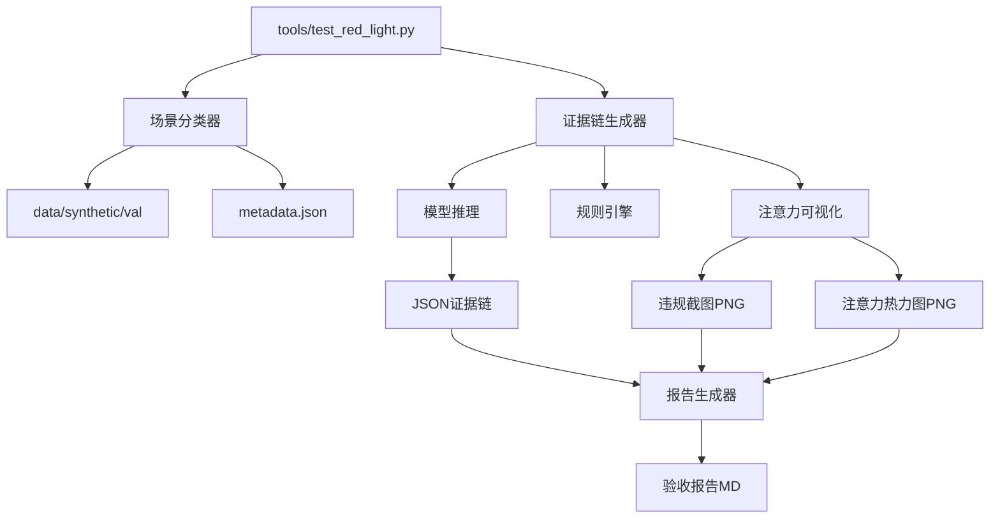
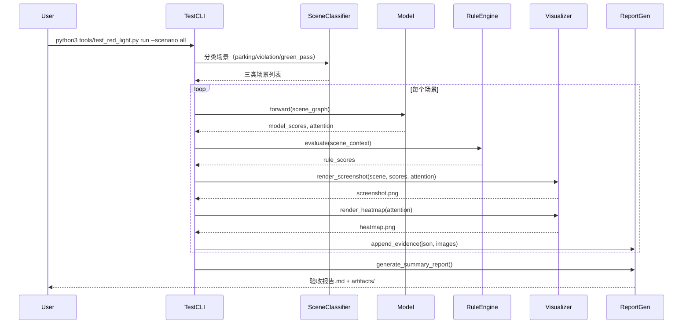

# 详细设计：集成测试与端到端验收流程

## A. 需求概述

### 需求编号
- 关联：BIZ-001（红灯停MVP场景）验收部分
- 缺口：三场景分类测试、违规截图、自动化报告

### 业务价值
- 确保MVP满足验收标准："CLI 训练成功、测试三种场景通过，生成违规报告与违规截图"
- 提供可复现的验收流程，便于QA和业务方评审
- 建立自动化测试基础，支撑后续迭代

### 验收标准
- ✅ 可执行三场景分类测试：`python3 tools/test_red_light.py run --scenario parking/violation/green_pass`
- ✅ 每个场景生成：JSON证据链 + 违规截图（PNG） + 注意力热力图（PNG）
- ✅ 生成汇总报告：Markdown格式，包含三场景统计、样例图片、指标对比
- ✅ 自动化脚本：一键运行全部验收测试

## B. 架构设计

### 组件图



### 数据流图



## C. 接口设计

### C.1 场景分类器

```python
class ScenarioClassifier:
    """
    场景分类器：将合成数据场景分为三类
    
    分类依据（从metadata.json或文件名推断）：
        - parking: 文件名包含'parking'或场景light_state=red且max(velocity)<0.5
        - violation: 文件名包含'violation'或light_state=red且(min(d_stop)<0或max(velocity)>1.0)
        - green_pass: 文件名包含'green'或light_state=green
    """
    
    def classify_scene(self, scene_path: Path, scene_data: SceneContext) -> str:
        """
        分类单个场景
        
        Args:
            scene_path: 场景文件路径
            scene_data: 场景数据
        
        Returns:
            scenario: 'parking' | 'violation' | 'green_pass'
        """
        # 策略1：从文件名推断
        filename = scene_path.stem.lower()
        if 'parking' in filename:
            return 'parking'
        if 'violation' in filename:
            return 'violation'
        if 'green' in filename:
            return 'green_pass'
        
        # 策略2：从场景特征推断
        light_state = self._get_light_state(scene_data)
        vehicles = scene_data.get_entities_by_type('car')
        
        if light_state == 'red':
            max_velocity = max(v.velocity for v in vehicles)
            min_distance = min(v.d_stop for v in vehicles)
            
            if max_velocity < 0.5 and min_distance > 0:
                return 'parking'
            else:
                return 'violation'
        else:
            return 'green_pass'
    
    def classify_dataset(
        self, 
        dataset: TrafficLightDataset
    ) -> Dict[str, List[int]]:
        """
        分类整个数据集
        
        Returns:
            scenario_indices: {
                'parking': [0, 3, 7, ...],
                'violation': [1, 5, ...],
                'green_pass': [2, 4, ...]
            }
        """
        ...
```

### C.2 违规截图生成器

```python
class ViolationScreenshotGenerator:
    """
    违规截图生成器：在场景图像上标注bbox、分数、注意力
    
    输出格式：
        - 绘制所有实体bbox（车辆/交通灯/停止线）
        - 标注模型分数、规则分数、最终分数
        - 用颜色编码注意力权重（红色=高注意力）
        - 标注违规判定结果
    """
    
    def generate(
        self,
        scene: SceneContext,
        model_output: Dict[str, torch.Tensor],
        rule_scores: torch.Tensor,
        threshold: float = 0.7,
        save_dir: Path = Path("reports/testing/screenshots"),
    ) -> Path:
        """
        生成单个场景的违规截图
        
        Args:
            scene: 场景数据
            model_output: 模型输出（含scores和attention）
            rule_scores: 规则分数
            threshold: 违规判定阈值
            save_dir: 保存目录
        
        Returns:
            screenshot_path: 生成的截图路径
        """
        # 1. 创建空白画布（如果没有原始图像）
        canvas = self._create_canvas(scene)
        
        # 2. 绘制所有实体
        for i, entity in enumerate(scene.entities):
            self._draw_entity(canvas, entity, ...)
        
        # 3. 标注违规车辆
        car_entities = scene.get_entities_by_type('car')
        for car_idx, car in enumerate(car_entities):
            model_score = model_output['scores'][car_idx].item()
            rule_score = rule_scores[car_idx].item()
            final_score = 0.6 * model_score + 0.4 * rule_score
            
            if final_score > threshold:
                self._highlight_violation(canvas, car, final_score)
        
        # 4. 添加图例和统计信息
        self._add_legend(canvas)
        self._add_stats(canvas, model_output, rule_scores)
        
        # 5. 保存
        screenshot_path = save_dir / f"{scene.scene_id}_screenshot.png"
        cv2.imwrite(str(screenshot_path), canvas)
        return screenshot_path
```

### C.3 验收报告生成器

```python
class AcceptanceReportGenerator:
    """
    验收报告生成器：汇总三场景测试结果，生成Markdown报告
    
    报告结构：
        1. 总览（三场景统计）
        2. 各场景详情（样例截图、指标）
        3. 指标对比表
        4. 典型案例展示
    """
    
    def generate_report(
        self,
        test_results: Dict[str, List[SceneResult]],
        save_path: Path = Path("reports/ACCEPTANCE_REPORT.md"),
    ) -> Path:
        """
        生成验收报告
        
        Args:
            test_results: {
                'parking': [SceneResult(...)],
                'violation': [SceneResult(...)],
                'green_pass': [SceneResult(...)]
            }
            save_path: 报告保存路径
        
        Returns:
            report_path: 生成的报告路径
        """
        sections = []
        
        # Section 1: 总览
        sections.append(self._generate_overview(test_results))
        
        # Section 2: 各场景详情
        for scenario, results in test_results.items():
            sections.append(self._generate_scenario_section(scenario, results))
        
        # Section 3: 指标对比
        sections.append(self._generate_metrics_comparison(test_results))
        
        # 写入文件
        content = "\n\n---\n\n".join(sections)
        save_path.write_text(content, encoding='utf-8')
        return save_path
```

## D. 算法设计

### D.1 场景分类算法

**输入**：场景文件路径 + SceneContext
**输出**：场景类别（'parking' | 'violation' | 'green_pass'）

**伪代码**：
```
function classify_scene(scene_path, scene_data):
    // 策略1：文件名匹配
    filename = scene_path.stem.lower()
    if 'parking' in filename:
        return 'parking'
    if 'violation' in filename:
        return 'violation'
    if 'green' in filename:
        return 'green_pass'
    
    // 策略2：特征推断
    light_state = extract_light_state(scene_data)
    vehicles = scene_data.get_entities_by_type('car')
    
    if light_state == 'red':
        max_v = max(v.velocity for v in vehicles)
        min_d = min(v.d_stop for v in vehicles)
        
        if max_v < 0.5 and min_d > 0:
            return 'parking'  // 停车：速度慢且未过线
        else:
            return 'violation'  // 违规：速度快或已过线
    else if light_state == 'green':
        return 'green_pass'  // 绿灯通行
    else:
        return 'unknown'  // 黄灯或未知，归到其他类别
```

**复杂度**：O(N)，N为车辆数量

### D.2 违规截图标注算法

**输入**：场景图像 + 实体列表 + 注意力权重 + 分数
**输出**：标注后的图像

**伪代码**：
```
function generate_screenshot(scene, model_output, rule_scores, threshold):
    canvas = create_canvas(800, 600)  // 或使用原始图像
    
    // 绘制所有实体bbox
    for entity in scene.entities:
        color = get_entity_color(entity.type)
        draw_rectangle(canvas, entity.bbox, color, thickness=2)
        draw_label(canvas, entity.type, entity.bbox.top_left)
    
    // 高亮违规车辆
    cars = scene.get_entities_by_type('car')
    for car_idx, car in enumerate(cars):
        final_score = 0.6 * model_output['scores'][car_idx] + 0.4 * rule_scores[car_idx]
        
        if final_score > threshold:
            // 红色粗框标注
            draw_rectangle(canvas, car.bbox, RED, thickness=4)
            
            // 显示分数
            text = f"违规! Score={final_score:.2f}"
            draw_text(canvas, text, car.bbox.top_left - (0, 20), color=RED)
            
            // 显示证据
            draw_text(canvas, f"d={car.d_stop:.1f}m v={car.velocity:.1f}m/s", ...)
    
    // 添加图例
    draw_legend(canvas, ...)
    
    // 保存
    save_image(canvas, output_path)
    return output_path
```

## E. 数据设计

### E.1 场景分类元数据

**扩展metadata.json**（由prepare_synthetic_data.py生成时添加）：
```json
{
  "total_scenes": 100,
  "split": {
    "train": 80,
    "val": 20
  },
  "scenario_distribution": {
    "parking": 40,
    "violation": 30,
    "green_pass": 30
  },
  "scene_metadata": {
    "scene_001": {
      "scenario_type": "parking",
      "light_state": "red",
      "num_cars": 3,
      "all_stopped": true
    },
    ...
  }
}
```

### E.2 验收报告数据结构

**SceneResult**（每个场景的测试结果）：
```python
@dataclass
class SceneResult:
    scene_id: str
    scenario_type: str  # 'parking' | 'violation' | 'green_pass'
    num_cars: int
    violations_detected: int
    evidence: List[Dict]  # 每辆车的证据链
    screenshot_path: Optional[Path]
    heatmap_path: Optional[Path]
    model_avg_score: float
    rule_avg_score: float
    final_avg_score: float
    test_passed: bool  # 是否符合预期
```

**验收汇总**：
```python
@dataclass
class AcceptanceSummary:
    total_scenes: int
    scenarios: Dict[str, int]  # {'parking': 40, 'violation': 30, ...}
    accuracy_by_scenario: Dict[str, float]  # 各场景准确率
    overall_metrics: Dict[str, float]  # AUC, F1等
    failed_scenes: List[str]  # 未通过验收的场景ID
    report_path: Path
```

## F. 依赖关系

### F.1 依赖模块
- `src/traffic_rules/data/traffic_dataset.py` - 数据加载
- `src/traffic_rules/graph/builder.py` - 场景图构建
- `src/traffic_rules/models/multi_stage_gat.py` - 模型推理
- `src/traffic_rules/rules/red_light.py` - 规则评分
- `src/traffic_rules/explain/attention_viz.py` - 可视化基础函数

### F.2 被依赖关系
- 被 CI/CD 流程调用（自动化验收）
- 被 QA 手动验收流程使用

## G. 实施计划

### G.1 任务分解

#### 任务1：扩展test_red_light.py支持场景分类（1天）
**文件**：`tools/test_red_light.py`

**修改点**：
1. 添加`--scenario`参数：`all` | `parking` | `violation` | `green_pass`
2. 实现`ScenarioClassifier`类（内嵌或独立文件）
3. 根据scenario参数过滤测试场景
4. 在输出JSON中添加`scenario_type`字段

**验证**：
```bash
python3 tools/test_red_light.py run --scenario parking --split val
python3 tools/test_red_light.py run --scenario violation --split val
python3 tools/test_red_light.py run --scenario green_pass --split val
```

#### 任务2：实现违规截图生成（1天）
**文件**：扩展 `tools/test_red_light.py` 或新增 `src/traffic_rules/testing/screenshot_gen.py`

**修改点**：
1. 调用`attention_viz.visualize_attention()`生成基础热力图
2. 扩展为完整标注（分数、bbox、违规标记）
3. 保存到`reports/testing/screenshots/<scene_id>.png`
4. 在场景JSON中添加`screenshot_path`字段

**验证**：
```bash
ls reports/testing/screenshots/*.png
```

#### 任务3：实现批量热力图渲染（2天）
**文件**：`scripts/render_attention_maps.py`

**修改点**：
1. 读取test_red_light.py输出的JSON证据链
2. 批量加载场景数据
3. 调用attention_viz为每个违规车辆生成热力图
4. 保存到`reports/testing/heatmaps/<scene_id>_car_<car_id>.png`

**验证**：
```bash
python3 scripts/render_attention_maps.py \
  --evidence-dir reports/testing \
  --data-root data/synthetic \
  --output-dir reports/testing/heatmaps
  
ls reports/testing/heatmaps/*.png
```

#### 任务4：实现验收报告生成器（1天）
**文件**：新增 `tools/generate_acceptance_report.py`

**功能**：
1. 读取所有场景JSON
2. 按scenario分类统计
3. 计算各场景准确率
4. 插入样例截图链接
5. 生成Markdown报告

**验证**：
```bash
python3 tools/generate_acceptance_report.py \
  --test-results reports/testing \
  --output reports/ACCEPTANCE_REPORT.md

cat reports/ACCEPTANCE_REPORT.md
```

#### 任务5：创建一键验收脚本（0.5天）
**文件**：`scripts/run_acceptance_test.sh`

**内容**：
```bash
#!/bin/bash
set -e

echo "========== MVP验收测试自动化脚本 =========="

# Step 1: 检查checkpoint
if [ ! -f "artifacts/checkpoints/best.pth" ]; then
    echo "错误：未找到checkpoint，请先运行训练"
    exit 1
fi

# Step 2: 运行三场景测试
echo "[1/4] 测试parking场景..."
python3 tools/test_red_light.py run --scenario parking --checkpoint artifacts/checkpoints/best.pth

echo "[2/4] 测试violation场景..."
python3 tools/test_red_light.py run --scenario violation --checkpoint artifacts/checkpoints/best.pth

echo "[3/4] 测试green_pass场景..."
python3 tools/test_red_light.py run --scenario green_pass --checkpoint artifacts/checkpoints/best.pth

# Step 3: 生成热力图
echo "[4/4] 生成注意力热力图..."
python3 scripts/render_attention_maps.py --evidence-dir reports/testing

# Step 4: 生成汇总报告
python3 tools/generate_acceptance_report.py --test-results reports/testing

echo "========== 验收测试完成 =========="
echo "报告位置: reports/ACCEPTANCE_REPORT.md"
```

### G.2 优先级排序
1. **任务1**（场景分类）- P0，是后续任务的基础
2. **任务2**（违规截图）- P0，验收必需
3. **任务3**（批量热力图）- P0，验收必需
4. **任务4**（报告生成）- P1，提升体验但非必需
5. **任务5**（一键脚本）- P1，自动化优化

### G.3 工作量估算
- **任务1**：1人日（6-8小时）
- **任务2**：1人日（6-8小时）
- **任务3**：2人日（12-16小时）
- **任务4**：1人日（6-8小时）
- **任务5**：0.5人日（3-4小时）
- **总计**：5.5人日（约1周）

### G.4 实施顺序
```
Day 1: 任务1（场景分类）
Day 2: 任务2（违规截图）
Day 3-4: 任务3（批量热力图）
Day 5: 任务4（报告生成）+ 任务5（一键脚本）
```

## H. 验证标准

### H.1 功能验证
- ✅ 可以按场景类别运行测试
- ✅ 每个场景生成完整artifacts（JSON + 截图 + 热力图）
- ✅ 验收报告包含三场景统计和样例
- ✅ 一键脚本可成功运行全流程

### H.2 质量验证
- ✅ 场景分类准确率100%（基于文件名或特征）
- ✅ 所有生成的图片可正常打开
- ✅ JSON证据链schema一致
- ✅ 报告格式规范，可读性好

## I. 参考资料
- 需求：REQUIREMENT.md - BIZ-001验收标准
- 测试指南：`docs/guides/TESTING_GUIDE.md`
- 注意力可视化：`src/traffic_rules/explain/attention_viz.py`
